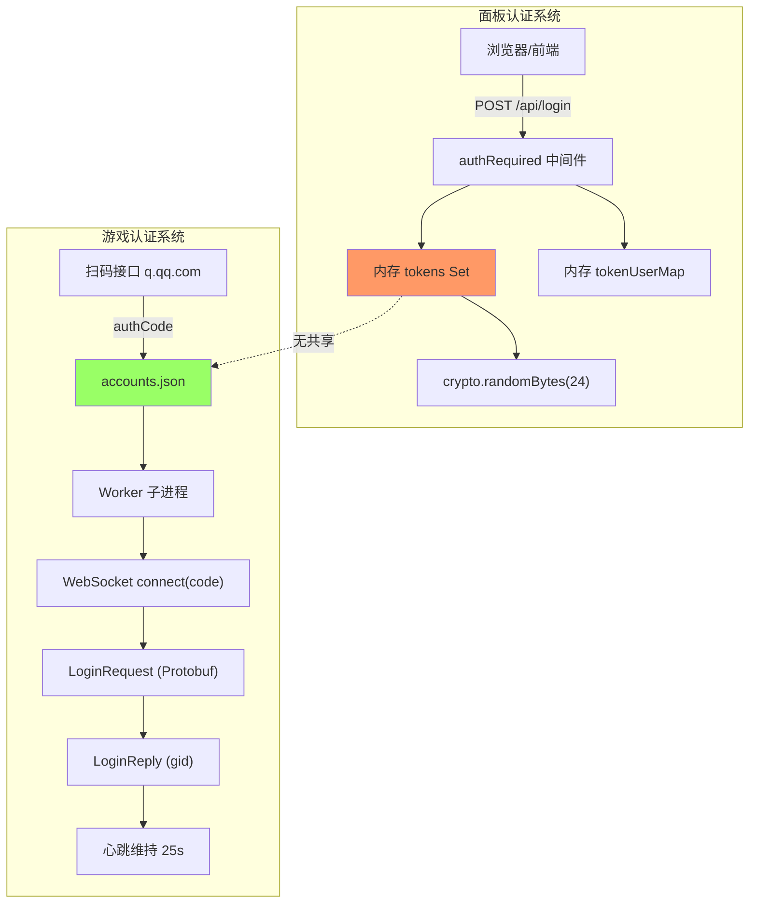
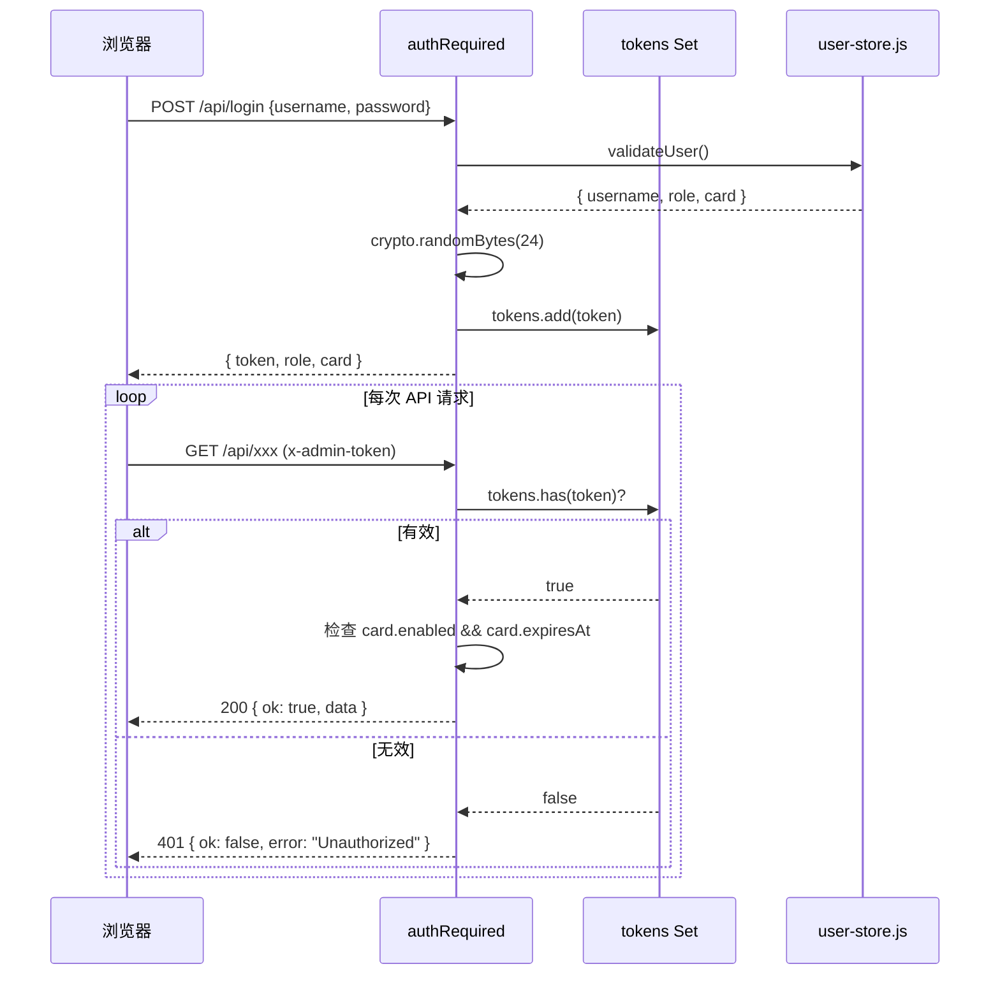
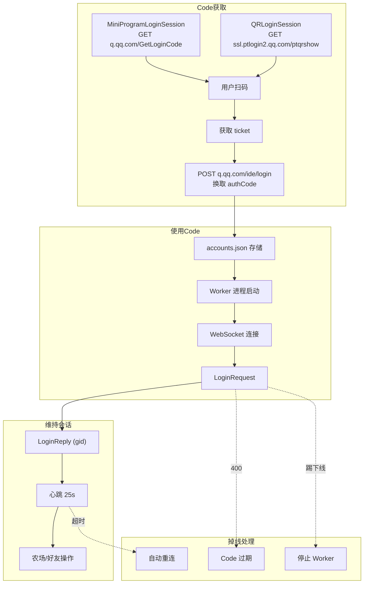
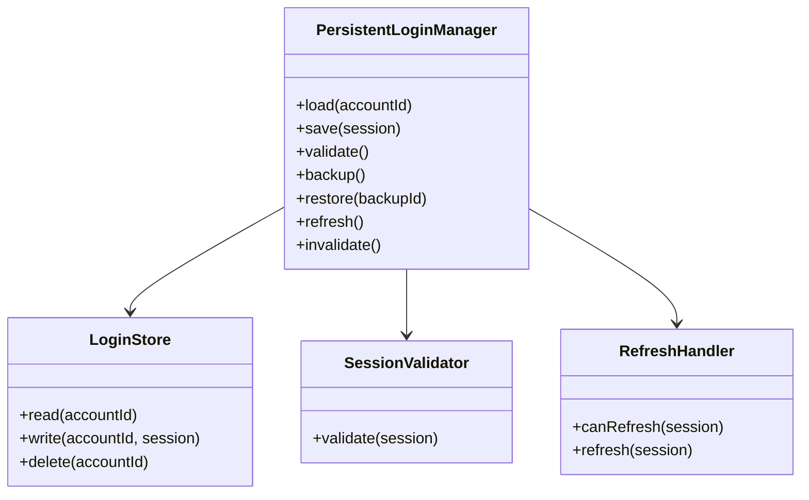
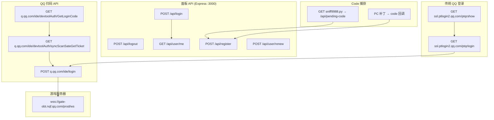
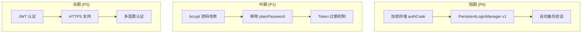

# QQ农场 Bot — 登录架构总览

> **版本:** 1.0  
> **最后更新:** 2026-06-26  
> **依据:** 代码逆向分析 `core/` 目录全部源文件

---

## 1. 架构概览

### 1.1 双系统架构

本项目存在**两个完全独立的认证系统**：

| 系统 | 用途 | 认证方式 | 凭证 |
|------|------|---------|------|
| **面板认证** | Web 管理面板 | HTTP 自定义请求头 | `x-admin-token` (48位随机hex) |
| **游戏认证** | QQ 农场登录 | WebSocket URL 参数 | `code` (一次性 authCode) |

**证据:** `controllers/admin.js` (面板) vs `utils/network.js` (游戏)，两套系统无共享代码。



---

## 2. 面板认证系统

### 2.1 架构

**证据:** `controllers/admin.js:77-114`

```
认证流程:
  Login Request → validateUser() → crypto.randomBytes(24) → tokens.add(token)
  ↓
  后续请求 → req.headers['x-admin-token'] → tokens.has(token)? → req.currentUser
  ↓
  Logout → tokens.delete(token)
```

### 2.2 关键组件

| 组件 | 实现 | 位置 |
|------|------|------|
| Token 生成 | `crypto.randomBytes(24).toString('hex')` | admin.js:79 |
| Token 存储 | `const tokens = new Set()` (内存) | admin.js:77 |
| 用户映射 | `const tokenUserMap = new Map()` (内存) | admin.js:134 |
| 认证中间件 | `authRequired` 检查 token + 用户状态 | admin.js:80-114 |
| 权限检查 | `adminRequired` 检查 role === 'admin' | admin.js:2412-2417 |
| 清理任务 | `cleanupExpiredUsers()` 每5分钟 | admin.js:174-211 |

### 2.3 Token 生命周期

**证据:** `controllers/admin.js:214-269 (login)`, `controllers/admin.js:1150-1164 (logout)`



### 2.4 风险

**证据:** 代码分析

| 风险 | 说明 | 等级 |
|------|------|------|
| 无持久化 | 服务重启后所有 token 丢失 | 🔴 高 |
| 无 JWT | Token 无签名，完全依赖内存查找 | 🟡 中 |
| SHA256 密码 | 非 bcrypt，暴力破解门槛低 | 🟡 中 |
| 明文密码 | `plainPassword` 与哈希并存 | 🔴 高 |
| 无过期时间 | Token 永不过期，除非手动清理 | 🟡 中 |

---

## 3. 游戏认证系统

### 3.1 架构

**证据:** `services/qrlogin.js`, `utils/network.js`, `core/worker.js`



### 3.2 认证协议

**证据:** `utils/network.js:588-629`

```
WebSocket URL:
  wss://gate-obt.nqf.qq.com/prod/ws
    ?platform=qq
    &os=iOS
    &ver=1.12.1.6_20260623
    &code={authCode}
    &openID=

消息格式:
  GateMessage (Protobuf) {
    service_name: "gamepb.userpb.UserService"
    method_name: "Login" / "Heartbeat" / ...
    body: WASM_encrypt(Protobuf_body)
    client_seq: number
    server_seq: number
  }
```

### 3.3 登录请求/响应

**证据:** `utils/network.js:421-508`

```protobuf
// LoginRequest (Protobuf)
message LoginRequest {
  sharer_id: ""
  sharer_open_id: ""
  device_info: {
    client_version: "1.12.1.6_20260623"
    sys_software: "iOS 26.2.1"
    network: "wifi"
    memory: "7672"
    device_id: "iPhone X<iPhone18,3>"
  }
  share_cfg_id: ""
  scene_id: "1256"
  report_data: { minigame_channel: "other", minigame_platid: 2 }
}

// LoginReply (Protobuf)
message LoginReply {
  basic: { gid: number, name: string, level: number, gold: number, exp: number }
  time_now_millis: number
  version_info: { game_version, min_version, recommend_version }
}
```

### 3.4 会话维持

**证据:** `utils/network.js:514-559`

| 机制 | 参数 | 说明 |
|------|------|------|
| 心跳间隔 | 25,000 ms | `setInterval` 发送 HeartbeatRequest |
| 超时检测 | 60,000 ms (2次) | `hbFailCount >= 2` 触发重连 |
| 重连延迟 | 5,000 ms | `setTimeout` 延迟重连 |
| 版本协商 | LoginReply/HeartbeatReply | 自动跟随服务器推荐版本 |
| 版本过低 | KickoutNotify + "版本过低" | `bumpClientVersion()` 自动递增 |

### 3.5 设备信息

**证据:** `config/config.js`, `runtime-engine.js`

```javascript
// 当前模拟的设备配置
CONFIG.device_info = {
    client_version: '1.12.1.6_20260623',
    sys_software: 'iOS 26.2.1',
    network: 'wifi',
    memory: '7672',
    device_id: 'iPhone X<iPhone18,3>',
}
```

---

## 4. Cookie 分析

### 4.1 使用情况

| Cookie | 系统 | 位置 |
|--------|------|------|
| `qrsig` | 传统 QQ 登录 | `services/qrlogin.js` |
| 无 | 面板认证 | 完全不使用 |
| 无 | 游戏 WebSocket | 完全不使用 |

**结论:** 本项目**几乎不使用 Cookie**。面板认证用 `x-admin-token` 头，游戏认证用 WebSocket URL 参数。

### 4.2 qrsig 生命周期

**证据:** `services/qrlogin.js:27-119`, `utils/qrutils.js`

```
1. GET ptqrshow → Set-Cookie: qrsig=xxx
2. 提取 qrsig → 计算 ptqrtoken = HashUtils.hash(qrsig)
3. GET ptqrlogin?ptqrtoken=xxx (Cookie: qrsig=xxx)
4. 轮询直到扫码成功或超时
5. qrsig 丢弃（无持久化）
```

---

## 5. 会话 (Session) 分析

### 5.1 面板会话

**证据:** `controllers/admin.js:77-79,80-114,174-211`

| 属性 | 值 |
|------|-----|
| **持久化** | ❌ 仅内存 |
| **服务重启存活** | ❌ 丢失 |
| **IP 变更存活** | ✅ 不受影响 |
| **刷新机制** | ❌ 无 |

### 5.2 游戏会话

**证据:** `utils/network.js`, `core/worker.js`

| 属性 | 值 |
|------|-----|
| **持久化** | ⚠️ code 存 accounts.json，但连接用后失效 |
| **重启存活** | ❌ 需要新 code |
| **自动刷新** | ❌ 腾讯不提供 refresh token |
| **心跳维持** | ✅ 25 秒间隔 |

### 5.3 会话失效原因

**证据:** `worker-manager.js:269-292`, `network.js:264-297`

| 原因 | 检测方式 | 自动恢复 |
|------|---------|---------|
| Code 过期 | WebSocket 400 | ❌ 需人工重新扫码 |
| 被踢下线 | KickoutNotify | ❌ 需重新添加账号 |
| 版本过低 | Kickout + "版本过低" | ✅ 自动递增重试(5次) |
| 网络断开 | 心跳超时 | ✅ 自动重连 |
| 服务重启 | 进程重启 | ❌ 需用新 code |

---

## 6. Token 分析

### 6.1 Token 全量搜索

**证据:** 全局搜索所有相关关键词

| Token | 出现位置 | 生成 | 存储 | 使用 | 过期 |
|-------|---------|------|------|------|------|
| 面板 Token | admin.js | crypto.randomBytes(24) | 内存 Set | x-admin-token 头 | 服务重启 |
| authCode | qrlogin.js | POST q.qq.com/ide/login | accounts.json | WebSocket URL | 一次性 + 短时效 |
| qrsig | qrlogin.js | Set-Cookie 响应 | 内存(未持久化) | Cookie 请求头 | 二维码超时 |
| wx access_token | admin.js | 微信 API | store.json | 微信接口调用 | 2小时 |

### 6.2 缺乏的关键机制

| 机制 | 状态 |
|------|------|
| Refresh Token | ❌ 不存在 |
| Token 轮换 | ❌ 无 |
| Token 持久化 | ❌ 仅内存 |
| JWT | ❌ 不使用 |

---

## 7. 持久化登录设计

### 7.1 设计目标

**证据:** 基于代码分析的设计提案 (`docs/persistent_login_design.md`)

1. 退出/重启后无需重新扫码
2. 自动检测会话失效
3. 加密存储凭据
4. 与现有架构完全兼容

### 7.2 核心组件



### 7.3 数据流

**证据:** 设计提案

```
启动 → PLM.load() → 解密 code → validate() → 有效 → 启动 Worker
                                                     ↓ 无效
                                              → 尝试 refresh()
                                                     ↓
                                              可刷新 → 刷新 → 更新存储 → 启动 Worker
                                              不可刷新 → 通知管理员
```

### 7.4 存储设计

- **格式:** JSON + AES-256-GCM 加密
- **位置:** `session-store.json` + 自动备份 `session-store.json.bak`
- **兼容:** `accounts.json` 保持写同步，支持回滚

---

## 8. 协议分析

### 8.1 腾讯自动刷新支持

| 机制 | 腾讯支持 | 证据 |
|------|---------|------|
| Refresh Token | ❌ | 无 refresh_token 相关代码 |
| Token Rotation | ❌ | code 一次性使用 |
| Silent Refresh | ❌ | 无静默重新认证端点 |
| Session Keepalive | ✅ | 心跳 25 秒 |
| Version Negotiation | ✅ | LoginReply + HeartbeatReply 返回 version_info |

### 8.2 核心协议端点

| 端点 | 协议 | 用途 |
|------|------|------|
| `wss://gate-obt.nqf.qq.com/prod/ws` | WebSocket + Protobuf + WASM 加密 | 游戏服务器 |
| `https://q.qq.com/ide/devtoolAuth/GetLoginCode` | HTTPS GET | 获取登录二维码 |
| `https://q.qq.com/ide/devtoolAuth/syncScanSateGetTicket` | HTTPS GET | 轮询扫码状态 |
| `https://q.qq.com/ide/login` | HTTPS POST | 用 ticket 换取 authCode |
| `https://ssl.ptlogin2.qq.com/ptqrshow` | HTTPS GET | 传统 QQ 二维码 |
| `https://ssl.ptlogin2.qq.com/ptqrlogin` | HTTPS GET | 传统 QQ 扫码轮询 |

---

## 9. HTTP 请求图



---

## 10. 验证检测点

### 10.1 面板验证

| 检测点 | 位置 | 检测方式 |
|--------|------|---------|
| Token 存在性 | admin.js:81 | `tokens.has(token)` |
| 用户封禁 | admin.js:91-101 | `card.enabled === false` |
| 用户过期 | admin.js:103-110 | `card.expiresAt < now` |
| 权限检查 | admin.js:2412-2417 | `role === 'admin'` |
| Socket.IO | admin.js:3611-3648 | `tokens.has(auth.token)` |

### 10.2 游戏验证

| 检测点 | 位置 | 检测方式 |
|--------|------|---------|
| WebSocket 连接 | network.js:588-629 | `ws.on('open')` |
| 登录验证 | network.js:421-508 | LoginReply 解析 |
| 踢下线 | network.js:264-297 | KickoutNotify |
| Code 过期 | worker-manager.js:269-280 | 400 错误 |
| 心跳超时 | network.js:514-559 | 60 秒无响应 |

---

## 11. 风险与改进

### 11.1 安全风险

| 风险 | 等级 | 说明 |
|------|------|------|
| 明文密码存储 | 🔴 高 | `plainPassword` 与哈希并存 |
| 无会话持久化 | 🔴 高 | 服务重启全部下线 |
| SHA256 密码 | 🟡 中 | 非慢哈希算法 |
| 无 HTTPS | 🟡 中 | code 在 URL 中明文传输 |
| WASM 加密 | 🟡 中 | 安全性依赖自定义实现 |

### 11.2 架构改进

| 改进 | 优先级 | 难度 |
|------|--------|------|
| 加密存储 authCode | P0 | 低 |
| 会话持久化 (PersistentLoginManager) | P0 | 中 |
| 密码改用 bcrypt | P1 | 低 |
| 移除 plainPassword 存储 | P1 | 低 |
| JWT 替代内存 Token | P2 | 中 |
| 接入 HTTPS | P2 | 低 |

### 11.3 未来方向



---

## 12. 参考文档

| 文档 | 路径 | 说明 |
|------|------|------|
| 项目树 | `docs/project_tree.md` | 完整目录结构 |
| 模块索引 | `docs/module_index.md` | 模块分类说明 |
| 依赖图 | `docs/dependency_graph.md` | 模块依赖关系 |
| 启动流程 | `docs/startup_flow.md` | 系统启动顺序 |
| 登录流程 | `docs/login_flow.md` | 登录流程逆向 |
| HTTP 请求 | `docs/http_requests.md` | 全部 HTTP 请求追踪 |
| Token 分析 | `docs/token_analysis.md` | Token 全量搜索 |
| Cookie 生命周期 | `docs/cookie_lifecycle.md` | Cookie 使用分析 |
| 会话分析 | `docs/session.md` | 会话状态分析 |
| 持久化登录设计 | `docs/persistent_login_design.md` | PLM 设计方案 |
| 协议分析 | `docs/protocol_analysis.md` | 腾讯协议支持 |
| 验证检测 | `docs/login_validation.md` | 登录验证检测点 |
| 自动恢复 | `docs/automatic_recovery.md` | 恢复工作流 |
| 迁移方案 | `docs/migration.md` | 代码迁移计划 |
| 测试计划 | `docs/test_plan.md` | 完整测试方案 |
| 管理员文档 | `docs/ADMIN.md` | 日常运维 |
| 开发者文档 | `docs/DEVELOPER.md` | 二次开发指南 |

---

> **证据声明:** 本文档所有结论均来自以下源文件的分析:
> - `core/src/controllers/admin.js`
> - `core/src/utils/network.js`
> - `core/src/services/qrlogin.js`
> - `core/src/services/oauth.js`
> - `core/src/models/user-store.js`
> - `core/src/models/store.js`
> - `core/src/core/worker.js`
> - `core/src/runtime/worker-manager.js`
> - `core/src/runtime/runtime-engine.js`
> - `core/src/runtime/relogin-reminder.js`
> - `core/src/services/manual-login-profile.js`
> - `core/src/utils/qrutils.js`
> - `core/src/config/config.js`
