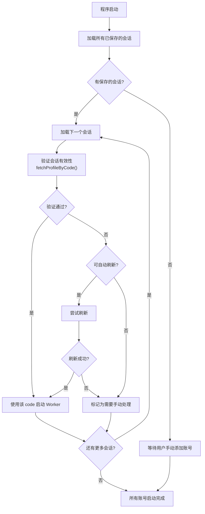
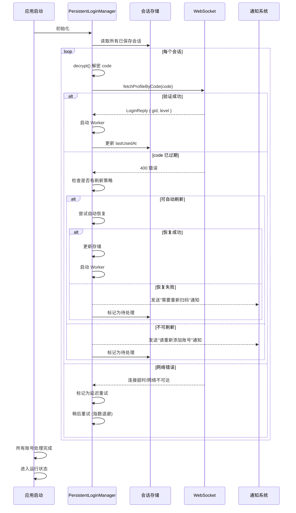
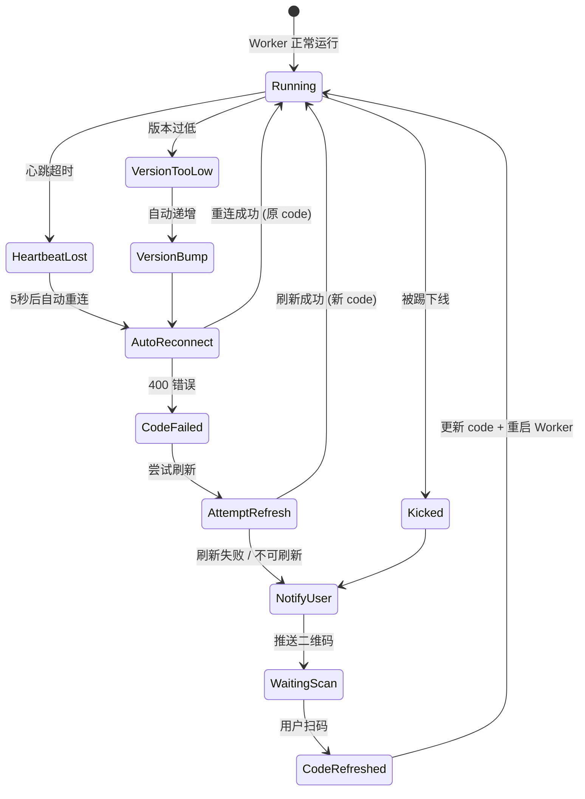
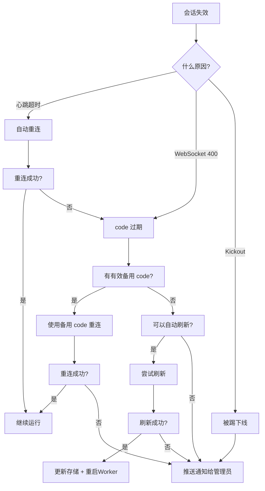

# 自动恢复工作流

> 设计: 程序启动时的自动恢复流程

---

## 1. 自动恢复总流程



---

## 2. 启动恢复详细流程



---

## 3. 运行中自动恢复



---

## 4. 自动恢复决策树



---

## 5. 错误处理矩阵

| 故障场景 | 自动检测 | 自动恢复 | 恢复方式 | 人工介入 |
|---------|---------|---------|---------|---------|
| 网络断开 | ✅ 心跳超时 | ✅ | 5秒后重连 | ❌ 不需要 |
| 临时中断 | ✅ WebSocket 关闭 | ✅ | 自动重连 | ❌ 不需要 |
| Code 过期 | ✅ 400 错误 | ❌ | 无刷新机制 | ✅ 需重新扫码 |
| 版本过低 | ✅ Kickout 检测 | ✅ | 自动递增版本(最多5次) | ❌ 不需要 |
| 被踢下线 | ✅ Kickout | ❌ | 停止 Worker | ✅ 需重新添加 |
| 服务器重启 | ✅ 连接断开 | ⚠️ | 重连(若 code 有效) | ⚠️ 可能需重新扫码 |
| IP 变更 | ❌ 服务器端检测 | ❌ | 未知 | ⚠️ 待测试 |

---

## 6. 自动恢复配置选项

```typescript
interface AutoRecoveryConfig {
  // 自动重连
  autoReconnect: boolean;          // 是否自动重连 (默认: true)
  reconnectDelay: number;          // 重连延迟 (默认: 5000ms)
  maxReconnectAttempts: number;    // 最大重连次数 (默认: -1, 无限)

  // 版本过低自动修复
  autoBumpVersion: boolean;        // 是否自动递增版本 (默认: true)
  maxVersionBumps: number;         // 最大版本递增次数 (默认: 5)

  // Code 刷新
  enableAutoRefresh: boolean;      // 是否启用自动刷新 (默认: false)
  refreshStrategy: RefreshStrategy; // 刷新策略

  // 通知
  notifyOnFailure: boolean;        // 失败时推送通知 (默认: true)
  notifyChannels: string[];        // 通知渠道

  // 存储
  backupEnabled: boolean;          // 是否启用自动备份 (默认: true)
  backupInterval: number;          // 备份间隔 (默认: 3600000ms = 1小时)
  maxBackups: number;              // 最大备份保留数 (默认: 10)
}
```
