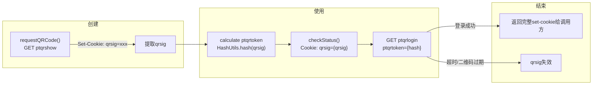
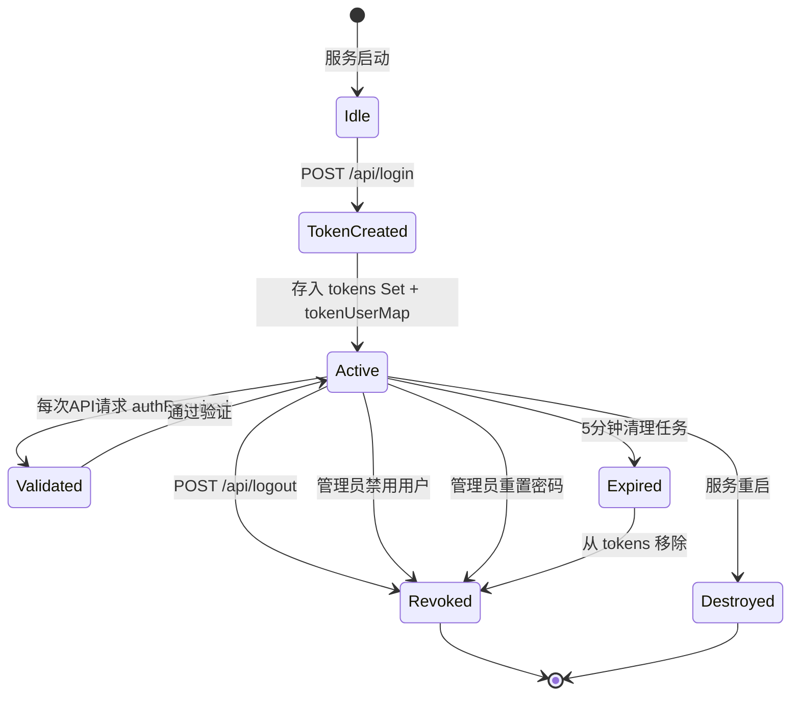
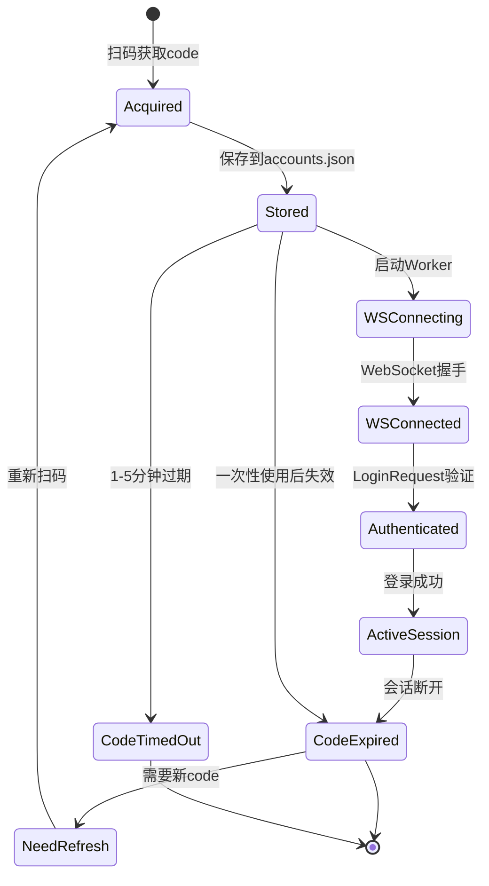

# Cookie 生命周期

> 来源: 代码逆向分析

---

## 1. 概述

**本项目不使用传统 Cookie 进行认证。** 面板认证使用自定义 `x-admin-token` 头，游戏认证使用 WebSocket URL 中的 `code` 参数。

唯一的 Cookie 使用场景是 **传统 QQ 网页登录**（`QRLoginSession`），用于获取和轮询二维码状态。

---

## 2. Cookie 出现位置

| Cookie | 出现位置 | 用途 |
|--------|---------|------|
| `qrsig` | `qrlogin.js:37` | QQ 传统网页登录的二维码会话标识 |
| 无 | `controllers/admin.js` | 面板系统完全不使用 Cookie |
| 无 | `network.js` | 游戏 WebSocket 不使用 Cookie |

---

## 3. qrsig Cookie 生命周期

## 4. qrsig 详情

| 属性 | 值 |
|------|-----|
| **来源** | `Set-Cookie` 响应头从 `https://ssl.ptlogin2.qq.com/ptqrshow` |
| **提取方式** | `CookieUtils.getValue(setCookie, 'qrsig')` |
| **存储** | 调用方内存（未持久化） |
| **使用** | `Cookie: qrsig={value}` 请求头发送到 `ptqrlogin` |
| **关联** | `ptqrtoken = hash(qrsig)` 用于 URL 参数 |
| **销毁** | 二维码验证完成或超时后丢弃 |
| **轮换** | 每次 `requestQRCode()` 生成新的 qrsig |
| **备份** | 无 |
| **验证** | 无本地验证，服务器端验证 |

## 5. Token 生命周期（面板认证）

虽然不使用 Cookie，但面板有类似 Cookie 的 Token 生命周期：

| 阶段 | 说明 |
|------|------|
| **创建** | `POST /api/login` 验证用户名密码后生成 48 位随机 hex |
| **使用** | 每个 API 请求的 `x-admin-token` 头 |
| **验证** | `authRequired` 中间件检查 `tokens.has(token)` |
| **刷新** | ❌ 无刷新机制 |
| **轮换** | ❌ 无自动轮换 |
| **撤销** | `POST /api/logout`、管理员操作、清理任务 |
| **备份** | ❌ 无备份，仅内存 |
| **过期** | 无固定过期时间，服务重启后全部失效 |

## 6. 游戏 authCode 生命周期

| 阶段 | 说明 |
|------|------|
| **创建** | QQ 小程序扫码 → ticket → `POST /ide/login` → authCode |
| **存储** | accounts.json（持久化），但网络层仅在内存中存 `savedCode` |
| **使用** | WebSocket URL 参数 `code={authCode}` |
| **验证** | WebSocket 服务器在 LoginRequest 中验证 |
| **刷新** | ❌ 无刷新，重新扫码获取新 code |
| **备份** | accounts.json 中有历史 code（但已失效） |
| **过期** | 一次性 + 短时效（1-5分钟），WebSocket 400 错误表示失效 |
