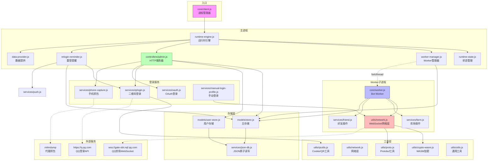
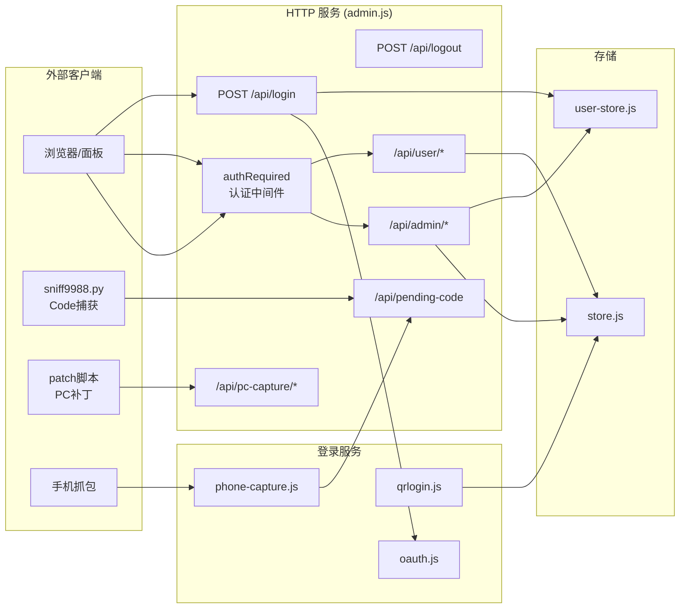
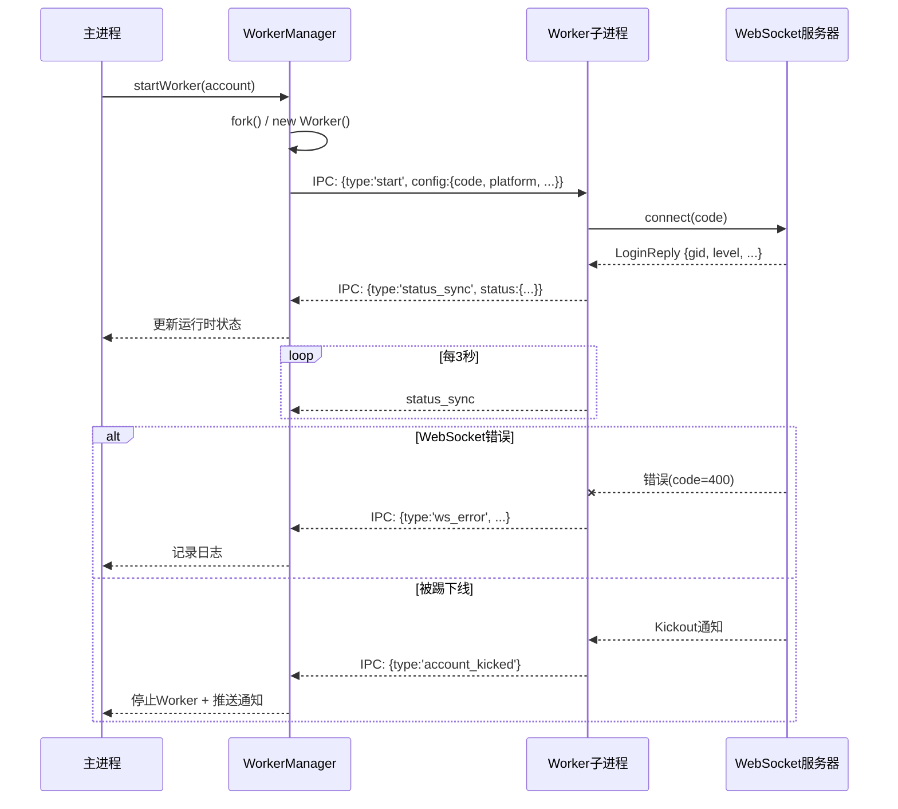
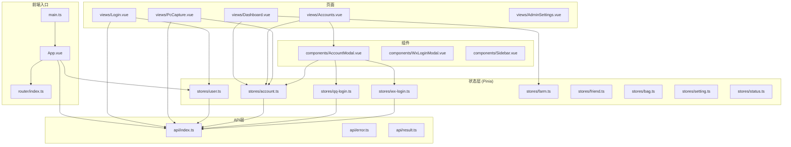

# 依赖关系图

> 模块间的调用依赖关系

## 1. 运行时依赖图

```mermaid
graph TB
    subgraph "入口"
        client["core/client.js<br/>进程管理器"]
    end

    subgraph "主进程"
        engine["runtime-engine.js<br/>运行时引擎"]
        state["runtime-state.js<br/>状态管理"]
        wm["worker-manager.js<br/>Worker管理器"]
        admin["controllers/admin.js<br/>HTTP服务器"]
        remind["relogin-reminder.js<br/>重登提醒"]
        dp["data-provider.js<br/>数据提供"]
    end

    subgraph "Worker子进程"
        worker["core/worker.js<br/>Bot Worker"]
        network["utils/network.js<br/>WebSocket网络层"]
        farm["services/farm.js<br/>农场操作"]
        friend["services/friend.js<br/>好友操作"]
    end

    subgraph "存储层"
        store["models/store.js<br/>主存储"]
        userStore["models/user-store.js<br/>用户存储"]
        jsondb["services/json-db.js<br/>JSON原子读写"]
    end

    subgraph "登录服务"
        qrlogin["services/qrlogin.js<br/>二维码登录"]
        oauth["services/oauth.js<br/>OAuth登录"]
        phoneCap["services/phone-capture.js<br/>手机抓包"]
        manualProfile["services/manual-login-profile.js<br/>手动登录"]
    end

    subgraph "工具层"
        crypto["utils/crypto-wasm.js<br/>WASM加密"]
        netUtil["utils/network.js<br/>网络层"]
        qrUtils["utils/qrutils.js<br/>Cookie/QR工具"]
        proto["utils/proto.js<br/>Protobuf工具"]
        utils["utils/utils.js<br/>通用工具"]
    end

    subgraph "外部服务"
        ws["wss://gate-obt.nqf.qq.com<br/>QQ农场WebSocket"]
        qqOAuth["https://q.qq.com<br/>QQ登录API"]
        mitm["mitmdump<br/>代理抓包"]
    end

    %% 依赖关系
    client --> engine
    engine --> state
    engine --> wm
    engine --> admin
    engine --> remind
    engine --> dp

    wm --> store
    wm -. "fork/thread" .-> worker

    admin --> store
    admin --> userStore
    admin --> qrlogin
    admin --> oauth
    admin --> phoneCap

    remind --> qrlogin
    remind --> store
    remind --> push["services/push.js"]

    worker --> network
    worker --> farm
    worker --> friend
    worker --> store

    manualProfile --> network
    qrlogin --> qrUtils
    network --> crypto
    network --> proto
    network -.-> ws

    qrlogin -.-> qqOAuth
    phoneCap -.-> mitm

    store --> jsondb
    userStore --> jsondb

    style client fill:#f9f,stroke:#333
    style worker fill:#bbf,stroke:#33a
    style admin fill:#bfb,stroke:#3a3
    style network fill:#fbb,stroke:#a33
```

## 2. HTTP API 依赖关系

```mermaid
graph LR
    subgraph "外部客户端"
        browser["浏览器/面板"]
        sniff["sniff9988.py<br/>Code捕获"]
        patch["patch脚本<br/>PC补丁"]
        mobile["手机抓包"]
    end

    subgraph "HTTP 服务 (admin.js)"
        authMID["authRequired<br/>认证中间件"]
        loginAPI["POST /api/login"]
        logoutAPI["POST /api/logout"]
        userAPI["/api/user/*"]
        adminAPI["/api/admin/*"]
        captAPI["/api/pc-capture/*"]
        pendAPI["/api/pending-code"]
    end

    subgraph "登录服务"
        qrLogin["qrlogin.js"]
        oa["oauth.js"]
        pc["phone-capture.js"]
    end

    subgraph "存储"
        uStore["user-store.js"]
        storeM["store.js"]
    end

    browser --> loginAPI
    browser --> authMID --> userAPI
    browser --> authMID --> adminAPI

    loginAPI --> uStore
    loginAPI --> oa
    userAPI --> storeM
    adminAPI --> uStore
    adminAPI --> storeM

    sniff --> pendAPI
    patch --> captAPI
    mobile --> pc --> pendAPI

    qrLogin --> storeM
```

## 3. 进程间通信依赖

```mermaid
sequenceDiagram
    participant Main as 主进程
    participant WM as WorkerManager
    participant Worker as Worker子进程
    participant WS as WebSocket服务器

    Main->>WM: startWorker(account)
    WM->>WM: fork() / new Worker()
    WM->>Worker: IPC: {type:'start', config:{code, platform, ...}}
    Worker->>WS: connect(code)
    WS-->>Worker: LoginReply {gid, level, ...}
    Worker-->>WM: IPC: {type:'status_sync', status:{...}}
    WM-->>Main: 更新运行时状态

    loop 每3秒
        Worker-->>WM: status_sync
    end

    alt WebSocket错误
        WS--xWorker: 错误(code=400)
        Worker-->>WM: IPC: {type:'ws_error', ...}
        WM-->>Main: 记录日志
    else 被踢下线
        WS-->>Worker: Kickout通知
        Worker-->>WM: IPC: {type:'account_kicked'}
        WM-->>Main: 停止Worker + 推送通知
    end
```

## 4. 前端模块依赖

```mermaid
graph TB
    subgraph "前端入口"
        main["main.ts"]
        app["App.vue"]
        router["router/index.ts"]
    end

    subgraph "状态层 (Pinia)"
        user["stores/user.ts"]
        account["stores/account.ts"]
        qqLogin["stores/qq-login.ts"]
        wxLogin["stores/wx-login.ts"]
        farm["stores/farm.ts"]
        friend["stores/friend.ts"]
        bag["stores/bag.ts"]
        setting["stores/setting.ts"]
        status["stores/status.ts"]
    end

    subgraph "API层"
        api["api/index.ts"]
        error["api/error.ts"]
        result["api/result.ts"]
    end

    subgraph "页面"
        loginView["views/Login.vue"]
        dash["views/Dashboard.vue"]
        accounts["views/Accounts.vue"]
        pcCapture["views/PcCapture.vue"]
        adminSet["views/AdminSettings.vue"]
    end

    subgraph "组件"
        accModal["components/AccountModal.vue"]
        wxModal["components/WxLoginModal.vue"]
        sidebar["components/Sidebar.vue"]
    end

    main --> app
    app --> router
    app --> user
    app --> api

    loginView --> api
    loginView --> user

    dash --> account
    dash --> farm

    accounts --> account
    accounts --> accModal

    pcCapture --> account
    pcCapture --> api

    accModal --> qqLogin
    accModal --> wxLogin
    accModal --> account

    user --> api
    account --> api
    qqLogin --> api
    wxLogin --> api
```
