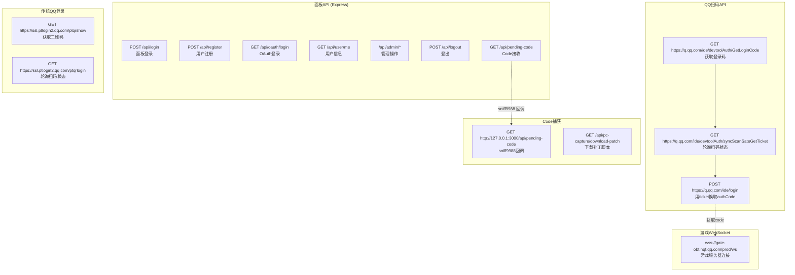
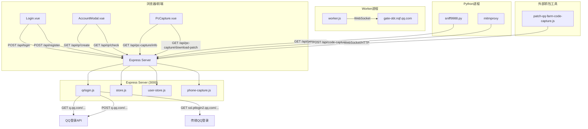
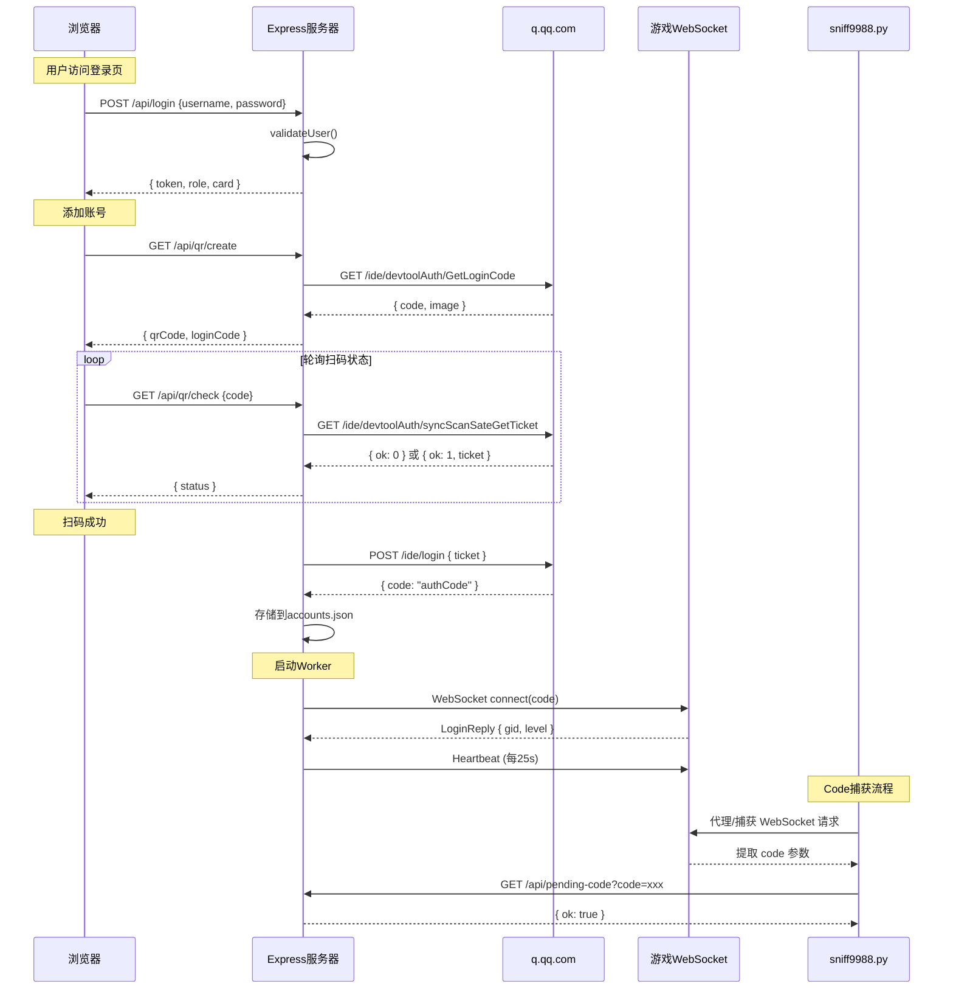

# HTTP 请求追踪

> 来源: 代码逆向分析 | 所有 HTTP/HTTPS/WebSocket 请求的完整追踪

---

## 1. 请求总览图



---

## 2. 请求详情

### 2.1 面板登录请求

#### `POST /api/login`

| 属性 | 值 |
|------|-----|
| **源文件** | `core/src/controllers/admin.js:214-269` |
| **URL** | `http://{host}:3000/api/login` |
| **方法** | POST |
| **请求头** | `Content-Type: application/json` |
| **请求体** | `{ username: string, password: string }` 或 `{ password: string }` |
| **成功响应** | `{ ok: true, data: { token: "48位hex", role: "admin"|"user", card: {...}, user: {...} } }` |
| **状态码** | 200 |
| **失败响应** | `{ ok: false, error: "用户名或密码错误" }` |
| **状态码** | 401 |
| **Cookie** | 无（使用 `x-admin-token` 请求头） |
| **副作用** | 生成 token 存入内存 `tokens` Set + `tokenUserMap` |

#### `POST /api/logout`

| 属性 | 值 |
|------|-----|
| **源文件** | `core/src/controllers/admin.js:1150-1164` |
| **URL** | `http://{host}:3000/api/logout` |
| **方法** | POST |
| **请求头** | `x-admin-token: {token}` |
| **响应** | `{ ok: true }` |
| **副作用** | 从 `tokens` Set + `tokenUserMap` 删除, 断开 WebSocket |

#### `GET /api/user/me`

| 属性 | 值 |
|------|-----|
| **源文件** | `core/src/controllers/admin.js:2652-2669` |
| **URL** | `http://{host}:3000/api/user/me` |
| **方法** | GET |
| **请求头** | `x-admin-token: {token}` |
| **响应** | `{ ok: true, data: { username, role, card: {...} } }` |

---

### 2.2 QQ 小程序扫码请求

#### `GET /ide/devtoolAuth/GetLoginCode`

| 属性 | 值 |
|------|-----|
| **源文件** | `core/src/services/qrlogin.js:148-177` |
| **URL** | `https://q.qq.com/ide/devtoolAuth/GetLoginCode` |
| **方法** | GET |
| **请求头** | `qua: V1_HT5_QDT_0.70.2209190_x64_0_DEV_D` |
| | `Host: q.qq.com` |
| | `User-Agent: Mozilla/5.0 (Windows NT 10.0; Win64; x64) AppleWebKit/537.36 (KHTML, like Gecko) Chrome/120.0.0.0 Safari/537.36` |
| **响应体** | `{ code: "6位短码", image: "base64PNG", url: "qr链接" }` |
| **状态码** | 200 |
| **Cookie** | 无 |
| **用途** | 获取小程序登录二维码 |

#### `GET /ide/devtoolAuth/syncScanSateGetTicket`

| 属性 | 值 |
|------|-----|
| **源文件** | `core/src/services/qrlogin.js:179-234` |
| **URL** | `https://q.qq.com/ide/devtoolAuth/syncScanSateGetTicket?code={loginCode}` |
| **方法** | GET |
| **请求头** | 同上 |
| **响应体（等待）** | `{ ok: 0 }` |
| **响应体（成功）** | `{ ok: 1, ticket: "xxx", uin: "123456" }` |
| **响应体（已使用）** | `{ resCode: -10003 }` |
| **用途** | 轮询二维码扫码状态，获取 ticket |
| **轮询间隔** | 2 秒 |

#### `POST /ide/login`

| 属性 | 值 |
|------|-----|
| **源文件** | `core/src/services/qrlogin.js:236-278` |
| **URL** | `https://q.qq.com/ide/login` |
| **方法** | POST |
| **请求头** | `Content-Type: application/json`, `QUA`, `User-Agent` |
| **请求体** | `{ "appid": "1112386029", "ticket": "xxx" }` |
| **响应体** | `{ code: "authCode" }` |
| **响应体（失败）** | `{ code: "-1003" }`（负值表示授权失败） |
| **用途** | 用 ticket 换取正式的登录 authCode |

---

### 2.3 传统 QQ 登录请求

#### `GET /ptqrshow`

| 属性 | 值 |
|------|-----|
| **源文件** | `core/src/services/qrlogin.js:27-58` |
| **URL** | `https://ssl.ptlogin2.qq.com/ptqrshow?appid=21003204&e=2&l=M&s=3&d=72&v=4&t={random}&daid=19&u1=https://qzs.qq.com/qzone/v5/loginsucc.html?para=izone` |
| **方法** | GET |
| **响应头** | `Set-Cookie: qrsig=xxx` |
| **响应体** | 二维码图片二进制数据 |
| **Cookie** | 从 set-cookie 中提取 `qrsig` |
| **用途** | 获取 QQ 网页登录二维码 |

#### `GET /ptqrlogin`

| 属性 | 值 |
|------|-----|
| **源文件** | `core/src/services/qrlogin.js:59-119` |
| **URL** | `https://ssl.ptlogin2.qq.com/ptqrlogin?ptqrtoken={hash}&from_ui=1&aid=21003204&daid=19&action={timestamp}&pt_uistyle=40&js_ver=21020514&js_type=1&u1=https://qzs.qq.com/qzone/v5/loginsucc.html?para=izone` |
| **方法** | GET |
| **请求头** | `Cookie: qrsig={qrsig}`, `Referer: https://ssl.ptlogin2.qq.com/...`, `User-Agent: ChromeUA` |
| **响应体** | JSONP 格式 `ptuiCB(ret, '0', jumpUrl, msg, nickname, cookie)` |
| **ret=66** | 等待扫码 |
| **ret=0** | 登录成功 |
| **用途** | 轮询 QQ 二维码扫码状态 |

---

### 2.4 WebSocket 连接

#### `wss://gate-obt.nqf.qq.com/prod/ws`

| 属性 | 值 |
|------|-----|
| **源文件** | `core/utils/network.js:588-629` |
| **URL** | `wss://gate-obt.nqf.qq.com/prod/ws?platform=qq&os=iOS&ver=1.12.1.6_20260623&code={authCode}&openID=` |
| **方法** | WebSocket |
| **请求头** | `User-Agent: MicroMessenger/7.0.20.1781(Android)`, `Origin: https://gate-obt.nqf.qq.com` |
| **协议** | 自定义 Protobuf + WASM 加密 |

**WebSocket 消息序列：**

```
Client → Server: WebSocket Connect (with URL params)
Server → Client: WebSocket Open
Client → Server: LoginRequest (Protobuf encoded, WASM encrypted)
  Service: gamepb.userpb.UserService/Login
  Body: { device_info, share_cfg_id, scene_id: "1256", report_data }
Server → Client: LoginReply (Protobuf encoded, WASM encrypted)
  Body: { basic: { gid, name, level, gold, exp }, time_now_millis, version_info }
  
── 登录成功后的循环 ──
Client → Server: HeartbeatRequest (每25秒)
  Service: gamepb.userpb.UserService/Heartbeat
  Body: { gid, clientVersion }
Server → Client: HeartbeatReply
  Body: { time_now_millis, version_info }

── 农场操作 ──
Client → Server: AllLands Request
  Service: gamepb.plantpb.PlantService/AllLands
Client → Server: Harvest Request
  Service: gamepb.plantpb.PlantService/Harvest
Client → Server: Plant Request
  Service: gamepb.plantpb.PlantService/Plant
  
── 踢下线：Server → Client: KickoutNotify ──
```

---

### 2.5 Code 捕获请求

#### `GET /api/pending-code` (from sniff9988)

| 属性 | 值 |
|------|-----|
| **源文件** | `tools/sniff9988.py`, `core/src/controllers/admin.js` |
| **URL** | `http://127.0.0.1:3000/api/pending-code?code={code}&uin={uin}&nick={nick}&platform={platform}` |
| **方法** | GET |
| **请求源** | sniff9988.py （本地Python进程） |
| **响应** | `{ ok: true }` |
| **用途** | 捕获到的 Code 回调到面板 |

---

## 3. HTTP 请求图



---

## 4. 请求时序图



---

## 5. 客户端版本协商请求

这是 WebSocket 协议的一部分，不是独立 HTTP 请求：

| 阶段 | 方向 | 内容 | 说明 |
|------|------|------|------|
| LoginRequest | → | `device_info.client_version: "1.12.1.6_20260623"` | 发送当前版本 |
| LoginReply | ← | `version_info.recommend_version: "1.12.1.6_20260629"` | 服务器推荐版本 |
| Client | - | `CONFIG.clientVersion = recommend_version` | 自动更新本地版本 |
| HeartbeatRequest | → | `clientVersion: "1.12.1.6_20260629"` | 后续请求使用新版本 |
| Kickout(版本过低) | ← | 断开连接 | 版本检查失败 |
| Client | - | `bumpClientVersion()` | 自动递增版本号并重连 |

---

## 6. 请求头汇总

| 请求头 | 出现在 | 值 |
|--------|--------|-----|
| `x-admin-token` | 所有面板 API | 48位随机 hex 字符串 |
| `Content-Type` | POST 请求 | `application/json` |
| `User-Agent` (面板) | Express | `Mozilla/5.0 ... Chrome/...` |
| `User-Agent` (WebSocket) | game WebSocket | `MicroMessenger/7.0.20.1781(Android)` |
| `Origin` | WebSocket | `https://gate-obt.nqf.qq.com` |
| `QUA` | QQ API 请求 | `V1_HT5_QDT_0.70.2209190_x64_0_DEV_D` |
| `Cookie` | 传统 QQ 登录 | `qrsig={value}` |
| `Set-Cookie` | 传统 QQ 登录响应 | `qrsig={value}` |
