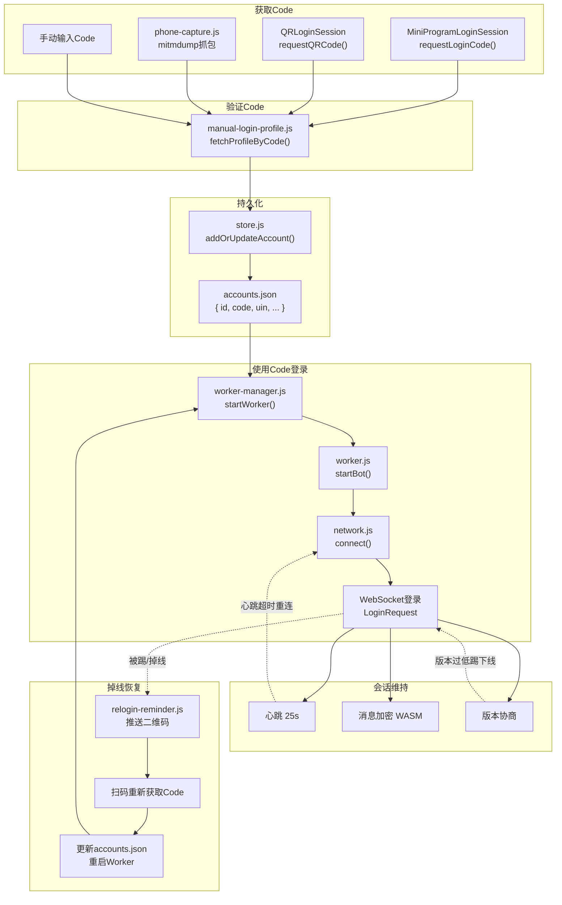
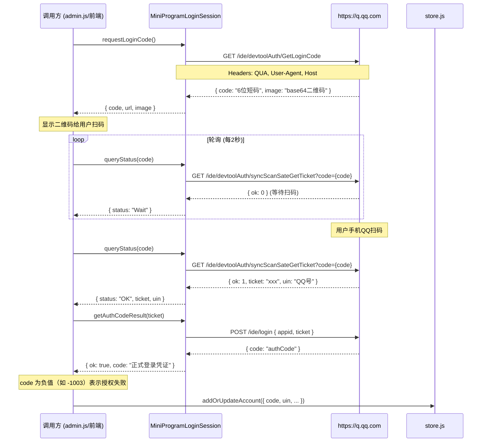
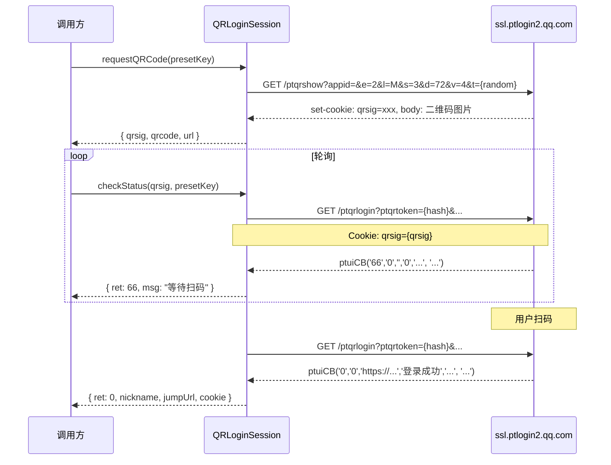
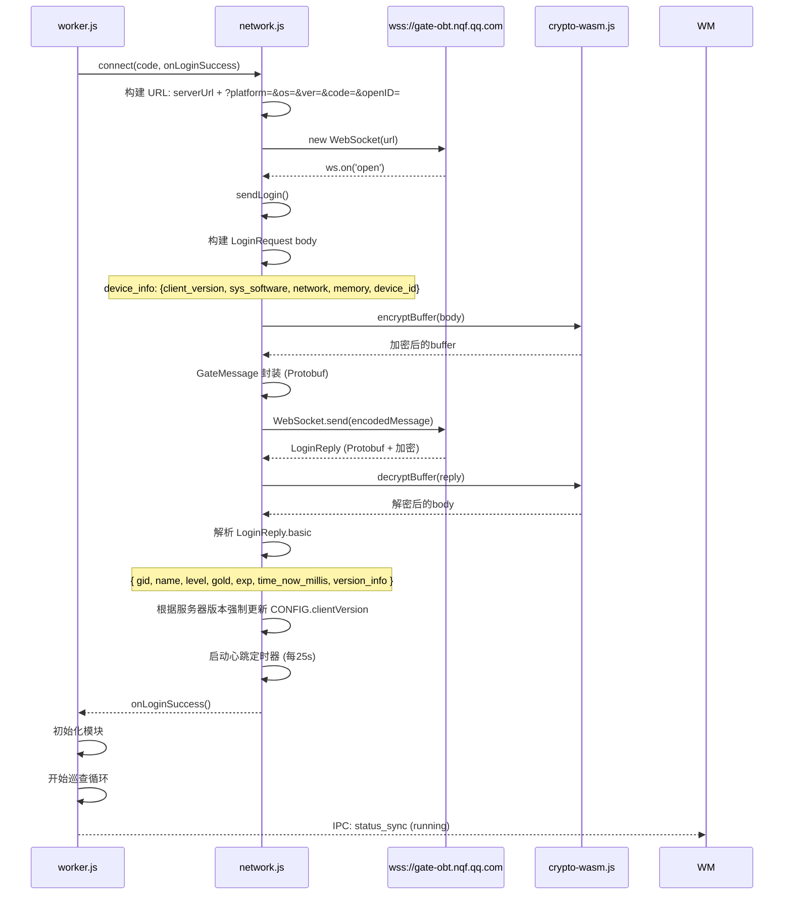
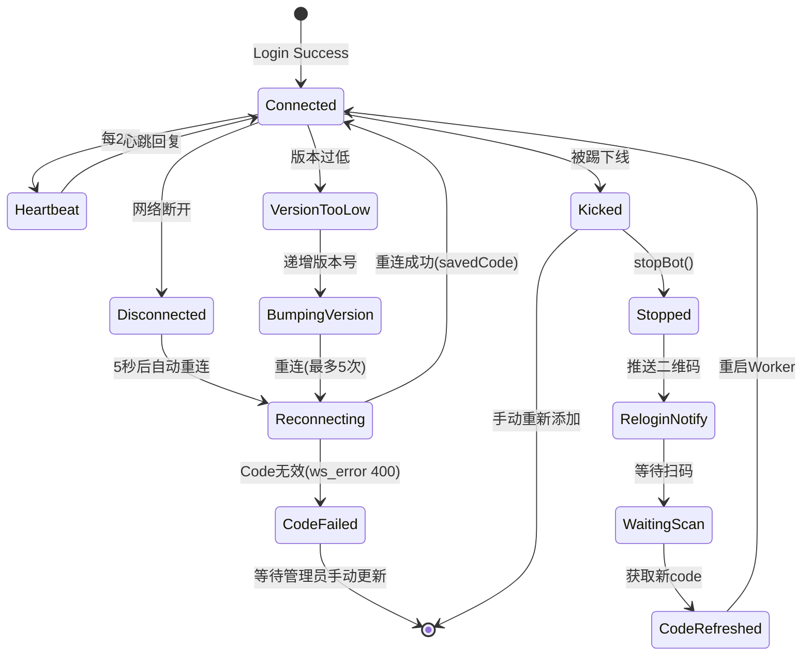
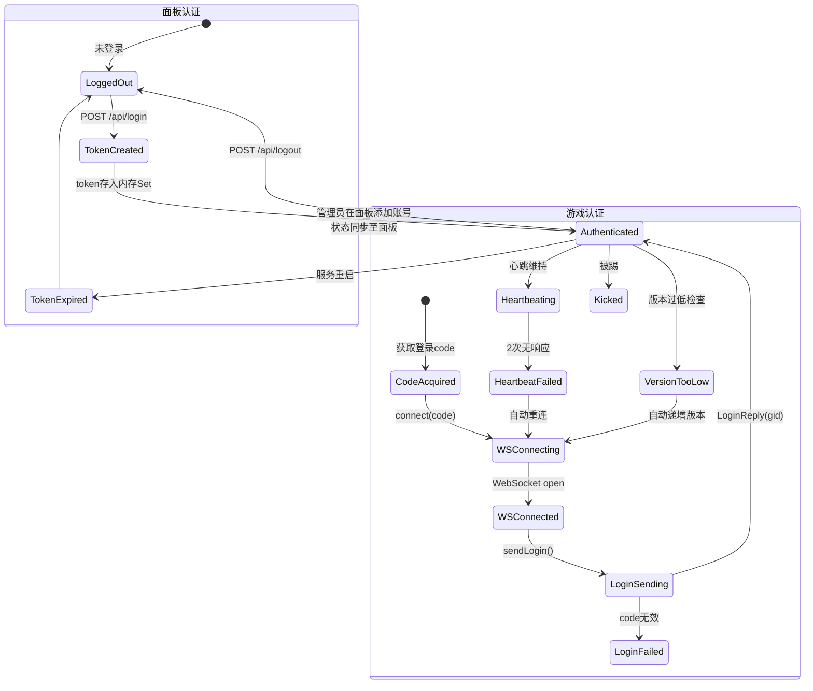

# 登录流程逆向分析

> 来源: 代码逆向分析 | `core/src/services/qrlogin.js`, `core/src/utils/network.js`, `core/src/core/worker.js`, `core/src/runtime/relogin-reminder.js`, `core/src/services/manual-login-profile.js`

---

## 1. 登录架构总览



---

## 2. Code 获取流程 (MiniProgramLoginSession)

这是当前项目主要使用的登录方式。它使用 QQ 小程序开发者工具接口获取登录码。

### 函数调用链



### 函数详情

#### `MiniProgramLoginSession.requestLoginCode()`

| 属性 | 值 |
|------|-----|
| **文件** | `core/src/services/qrlogin.js:148-177` |
| **HTTP方法** | GET |
| **URL** | `https://q.qq.com/ide/devtoolAuth/GetLoginCode` |
| **请求头** | `qua: V1_HT5_QDT_0.70.2209190_x64_0_DEV_D`, `User-Agent: ChromeUA` |
| **响应** | `{ code: string, image: string(base64), url: string }` |
| **副作用** | 无 |
| **异常** | 网络错误 → `console.error` |

#### `MiniProgramLoginSession.queryStatus(code)`

| 属性 | 值 |
|------|-----|
| **文件** | `core/src/services/qrlogin.js:179-234` |
| **HTTP方法** | GET |
| **URL** | `https://q.qq.com/ide/devtoolAuth/syncScanSateGetTicket?code={code}` |
| **响应** | `Wait → { ok: 0 }`, `OK → { ok: 1, ticket, uin }`, `Used → { resCode: -10003 }` |
| **副作用** | 无 |
| **异常** | 网络错误 → `console.error`, JSON解析错误 → 默认返回 `Wait` |

#### `MiniProgramLoginSession.getAuthCodeResult(ticket, appid)`

| 属性 | 值 |
|------|-----|
| **文件** | `core/src/services/qrlogin.js:236-278` |
| **HTTP方法** | POST |
| **URL** | `https://q.qq.com/ide/login` |
| **请求体** | `{ appid: "1112386029", ticket: "xxx" }` |
| **请求头** | `Content-Type: application/json`, `QUA`, `User-Agent` |
| **响应** | `{ code: "authCode" }` 或 `{ code: "-1003" }`（失败） |
| **副作用** | 无 |
| **异常** | 网络错误, HTTP 非200 |

---

## 3. 传统 QQ 网页登录 (QRLoginSession)

备用登录方式，使用 QQ 网页登录接口。

### 函数调用链



### 函数详情

#### `QRLoginSession.requestQRCode(presetKey)`

| 属性 | 值 |
|------|-----|
| **文件** | `core/src/services/qrlogin.js:27-58` |
| **HTTP方法** | GET |
| **URL** | `https://ssl.ptlogin2.qq.com/ptqrshow?appid={aid}&e=2&l=M&s=3&d=72&v=4&t={random}&daid={daid}&u1={redirectUri}` |
| **关键参数** | `aid = "21003204"`, `daid = "19"` |
| **Cookie** | 从 set-cookie 提取 `qrsig` |
| **响应** | 二维码图片（二进制） |
| **副作用** | 生成 qrsig cookie |

#### `QRLoginSession.checkStatus(qrsig, presetKey)`

| 属性 | 值 |
|------|-----|
| **文件** | `core/src/services/qrlogin.js:59-119` |
| **HTTP方法** | GET |
| **URL** | `https://ssl.ptlogin2.qq.com/ptqrlogin?ptqrtoken={HashUtils.hash(qrsig)}&aid={aid}&daid={daid}&u1={redirectUri}` |
| **Cookie** | `qrsig={qrsig}` |
| **响应** | JSONP 格式 `ptuiCB(ret, ..., msg, ..., jumpUrl, ...)` |
| **异常** | 网络错误 / JSONP 解析失败 |

---

## 4. WebSocket 登录流程 (游戏登录)

这是真正的游戏服务器认证。使用从上方获取的 `code` 连接 QQ 农场 WebSocket。

### 函数调用链



### 核心函数详情

#### `network.connect(code, onLoginSuccess, options)`

| 属性 | 值 |
|------|-----|
| **文件** | `core/src/utils/network.js:588-629` |
| **作用** | 建立 WebSocket 连接并发起登录 |
| **输入** | `code`(登录凭证), `onLoginSuccess`(回调), `options.proxyUrl` |
| **输出** | 无（调用回调） |
| **异常** | WebSocket 错误, 连接超时, 踢下线通知 |
| **副作用** | 设置 `savedCode`, 启动心跳, 发送 LoginRequest |

**WebSocket URL 结构：**
```
wss://gate-obt.nqf.qq.com/prod/ws?platform=qq&os=iOS&ver=1.12.1.6_20260623&code={CODE}&openID=
```

| 参数 | 来源 | 说明 |
|------|------|------|
| `platform` | CONFIG.platform | `qq` 或 `wx` |
| `os` | CONFIG.os | 模拟的操作系统 |
| `ver` | CONFIG.clientVersion | 客户端版本 (含日期后缀) |
| `code` | 参数传入 | 从扫码获取的登录凭证 |
| `openID` | 空 | 开放平台ID（当前未使用） |

**请求头：**
```
User-Agent: Mozilla/5.0 (Linux; Android 10; K) AppleWebKit/537.36 (KHTML, like Gecko) Chrome/114.0.0.0 Mobile Safari/537.36 MicroMessenger/7.0.20.1781
Origin: https://gate-obt.nqf.qq.com
```

#### `network.sendLogin(onLoginSuccess)`

| 属性 | 值 |
|------|-----|
| **文件** | `core/src/utils/network.js:421-508` |
| **作用** | 发送 Protobuf LoginRequest 并处理响应 |
| **输入** | `onLoginSuccess`(成功回调) |
| **输出** | 调用回调或发送错误事件 |
| **异常** | 加密失败, Protobuf 编码失败, 服务器返回错误码 |
| **副作用** | 更新 `userState`, 设置 `CONFIG.clientVersion`, 启动心跳 |

**LoginRequest Protobuf 结构：**
```protobuf
message LoginRequest {
    sharer_id: ""
    sharer_open_id: ""
    device_info: {
        client_version: "1.12.1.6_20260623"
        sys_software: "iOS 26.2.1"
        network: "wifi"
        memory: "7672"
        device_id: "iPhone X<iPhone18,3>"
    }
    share_cfg_id: ""
    scene_id: "1256"
    report_data: {
        minigame_channel: "other"
        minigame_platid: 2
        // ... 其他报告字段
    }
}
```

**LoginReply 结构：**
```protobuf
message LoginReply {
    basic: {
        gid: number       // 游戏UID（后续请求的用户标识）
        name: string      // 游戏昵称
        level: number     // 等级
        gold: number      // 金币
        exp: number       // 经验
    }
    time_now_millis: number   // 服务器时间戳
    version_info: {           // 版本协商
        game_version: string
        min_version: string
        recommend_version: string
    }
}
```

---

## 5. 手动登录获取资料 (fetchProfileByCode)

用于在获取到 code 后直接验证其有效性并获取用户资料。

### `manual-login-profile.fetchProfileByCode(code, options)`

| 属性 | 值 |
|------|-----|
| **文件** | `core/src/services/manual-login-profile.js` |
| **作用** | 通过 WebSocket 用 code 换取用户资料 |
| **输入** | `code`, `options.timeout`(默认10s) |
| **输出** | `{ gid, name, level, exp, gold, openId, avatar, remark, signature, gender }` |
| **异常** | 超时, 加密失败, 网关错误码 |
| **副作用** | 无（不持久化任何数据） |

---

## 6. 掉线自动恢复流程



## 7. 认证状态机



## 8. 关键发现

| 发现 | 证据 | 风险 |
|------|------|------|
| **无持久 Token**：游戏认证只靠一次性 `code` | network.js `connect()` 将 code 作为 URL 参数 | 掉线后必须重新获取 code |
| **无 Refresh Token**：Tencent 不提供令牌刷新 | 代码中无 refresh 逻辑，只重新扫码 | 无法自动维持长期会话 |
| **设备模拟**：登陆时伪装 iOS 设备 | config.js `os: 'iOS'`, `deviceId: 'iPhone X'` | 可能被服务器端检测封禁 |
| **版本协商**：服务器会强制客户端更新版本 | network.js 登录/心跳响应中处理 `version_info` | 版本过旧会被踢下线 |
| **自动版本递增**：版本过低时自动重试最多5次 | network.js `Kickout` 处理 `bumpClientVersion()` | 抗检测能力有限 |
| **WASM 加密**：消息体使用 WebAssembly 加密 | `crypto-wasm.encryptBuffer` | 难以逆向自定义协议 |
| **心跳敏感**：25秒间隔，60秒无响应触发重连 | `heartbeatInterval: 25000`, 2次超时检测 | 网络抖动会频繁重连 |
