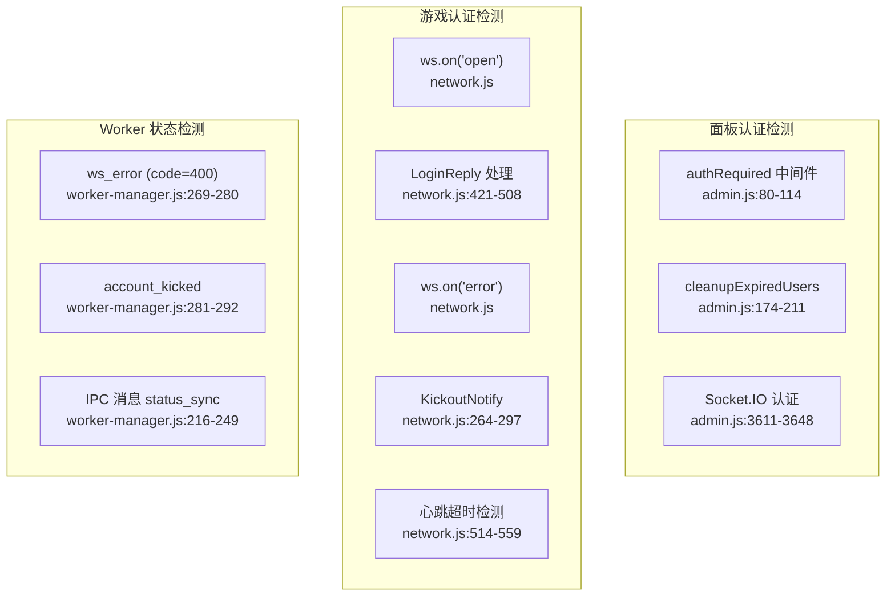
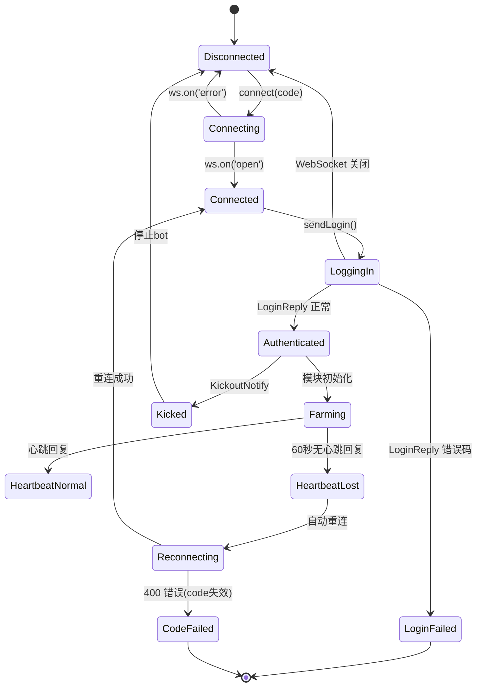
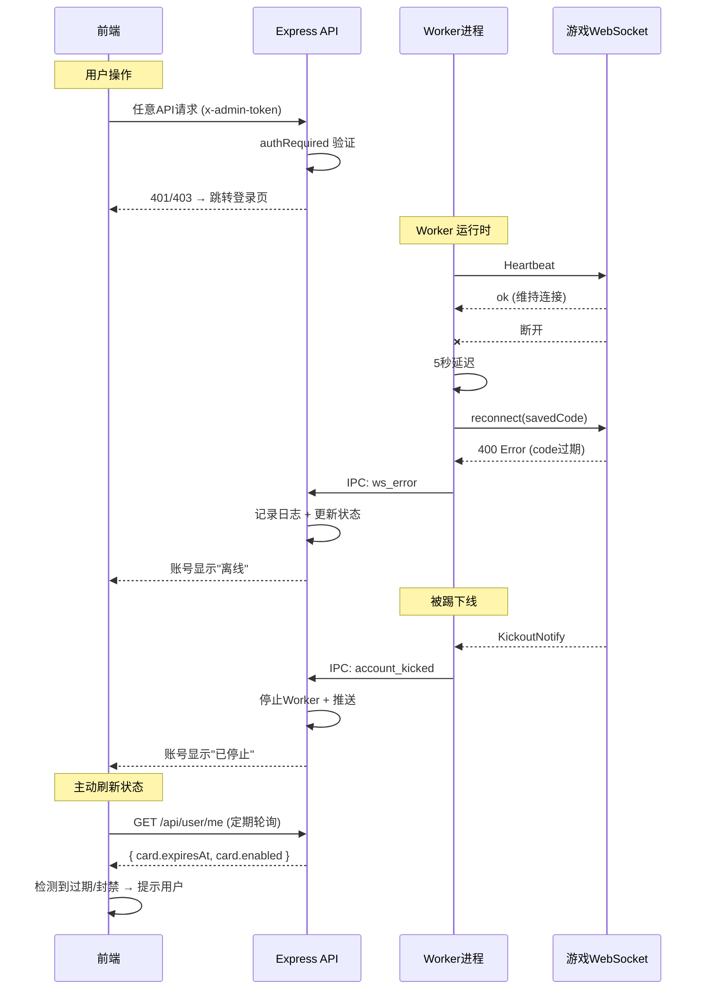

# 登录验证检测

> 查找所有检测登录状态的位置

---

## 1. 登录状态检测位置总览

---

## 2. 面板认证检测

### 2.1 `authRequired` 中间件 (admin.js:80-114)

| 检测点 | 检测方式 | 结果 |
|--------|---------|------|
| Token 存在性 | `tokens.has(token)` | 不存在 → 401 |
| 用户封禁状态 | `card.enabled === false` | 封禁 → 403 + 删除 token |
| 用户过期状态 | `card.expiresAt < now` | 过期 → 403 + 删除 token |
| 管理员豁免 | `role === 'admin'` | 跳过封禁/过期检查 |

**HTTP 状态码总结：**

| 状态码 | 含义 | 触发条件 |
|--------|------|---------|
| 200 | 成功 | 验证通过 |
| 401 | Unauthorized | Token 无效/不存在 |
| 403 | Forbidden | 封禁/过期 |

### 2.2 定期清理任务 (admin.js:174-211)

| 属性 | 值 |
|------|-----|
| **间隔** | 每5分钟 |
| **检测** | 遍历 `tokenUserMap` |
| **跳过的用户** | `role === 'admin'` |
| **清理动作** | 封禁/过期 → 删除 token + 断开 WebSocket |

### 2.3 Socket.IO 认证 (admin.js:3611-3648)

| 检测点 | 检测方式 |
|--------|---------|
| Token来源 | `socket.handshake.auth.token` 或 `socket.handshake.headers['x-admin-token']` |
| 验证 | `tokens.has(token)` |

---

## 3. 游戏认证检测

### 3.1 WebSocket 连接层

### 3.2 检测细节

| 检测点 | 检测方式 | 响应 |
|--------|---------|------|
| WebSocket 连接成功 | `ws.on('open')` | 发送 LoginRequest |
| 登录成功 | LoginReply 包含 `basic.gid` | 初始化模块 + 启动心跳 |
| WebSocket 错误 | `ws.on('error')` | 触发 `ws_error` 事件 |
| WebSocket 关闭 | `ws.on('close')` | 5秒后自动重连 |
| 踢下线 | KickoutNotify 消息 | 停止 bot + 通知主进程 |
| 版本过低 | KickoutNotify + "版本过低" | 自动递增版本重连 |
| 心跳超时 | 60秒 (2次) 无响应 | 断开重连 |
| Code 无效 | 连接被拒绝 (code=400) | 通知主进程 "需要更新 Code" |

### 3.3 HTTP/业务状态码

| 状态码/错误码 | 来源 | 含义 | 处理方式 |
|-------------|------|------|---------|
| WebSocket 400 | WebSocket 响应 | code 无效/过期 | 通知管理员 |
| Kickout(版本过低) | Protobuf 消息 | 客户端版本需更新 | 自动递增重试(5次) |
| authCode 负值 | q.qq.com API | 授权失败 (如 -1003) | Worker 拒绝启动 |
| ack fail | LoginReply | 登录被拒 | 停止 Worker |

---

## 4. 前端登录状态检测

| 文件 | 检测 | 方式 |
|------|------|------|
| `Login.vue` | 面板登录 | `POST /api/login` 响应 |
| `stores/user.ts` | 会话有效期 | 存储 token 到 localStorage |
| `api/index.ts` | 请求拦截 | 401 响应 → 跳转登录页 |
| `stores/account.ts` | 账号状态 | `status_sync` IPC 消息 |
| `stores/qq-login.ts` | QQ 扫码状态 | `GET /api/qr/check` 轮询 |
| `stores/wx-login.ts` | 微信扫码状态 | `POST /api/wx-qr/check` 轮询 |
| `PcCapture.vue` | PC 监听状态 | `GET /api/pc-capture/info` |

---

## 5. 检测事件流程图

