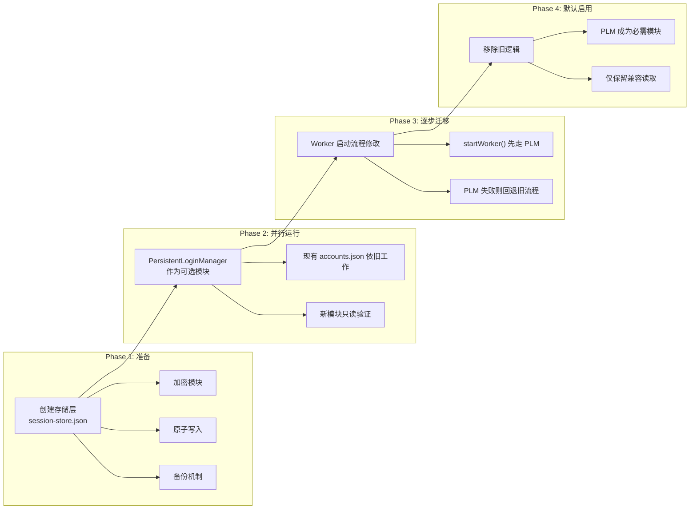
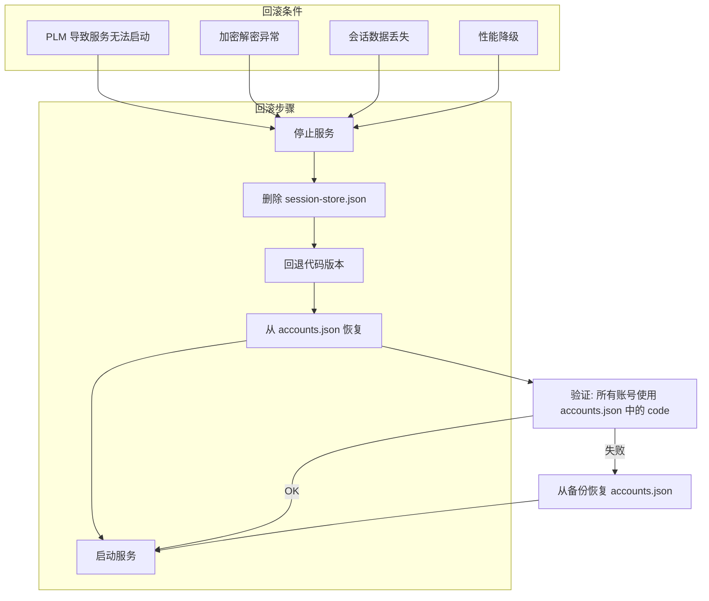

# 迁移方案

> 如何将 PersistentLoginManager 集成到现有代码中

---

## 1. 迁移策略

**原则：** 向后兼容，不修改现有业务逻辑，逐步替换。

### 1.1 阶段划分



---

## 2. 文件变更清单

### 2.1 新增文件

| 文件 | 用途 |
|------|------|
| `core/src/services/persistent-login.js` | PersistentLoginManager 实现 |
| `core/src/services/login-store.js` | 加密存储层 |
| `core/src/services/session-validator.js` | 会话验证器 |
| `core/src/services/refresh-handler.js` | 刷新处理器 |
| `core/src/utils/session-crypto.js` | 加密工具 |

### 2.2 修改文件

| 文件 | 修改内容 |
|------|---------|
| `core/src/runtime/runtime-engine.js` | 初始化 PLM |
| `core/src/runtime/worker-manager.js` | startWorker 中集成 PLM |
| `core/src/runtime/relogin-reminder.js` | 新 code 获取后更新 PLM |
| `core/src/services/qrlogin.js` | 获取新 code 后回写 PLM |
| `core/src/models/store.js` | 添加兼容读取方法 |
| `core/src/controllers/admin.js` | API 获取会话状态 |

### 2.3 无需修改的文件

| 文件 | 原因 |
|------|------|
| `core/src/core/worker.js` | Worker 仍接收 code 字符串 |
| `core/src/utils/network.js` | 网络层只关心 code 字符串 |
| `core/src/services/oauth.js` | OAuth 流程不变 |
| `core/src/services/phone-capture.js` | 手机抓包流程不变 |
| `web/` 所有文件 | 前端 API 不变 |

---

## 3. 修改点详情

### 3.1 runtime-engine.js 修改

```javascript
// 新增：初始化 PLM
async function initPersistentLogin() {
    const { PersistentLoginManager } = require('../services/persistent-login');
    const { LoginStore } = require('../services/login-store');
    const { SessionValidator } = require('../services/session-validator');
    const { RefreshHandler } = require('../services/refresh-handler');

    const store = new LoginStore({
        filePath: getDataFile('session-store.json'),
        cryptoKey: process.env.PERSISTENT_LOGIN_KEY || 'default-dev-key',
    });

    return new PersistentLoginManager({
        store,
        validator: new SessionValidator(),
        refreshHandler: new RefreshHandler(),
        autoBackup: true,
        backupInterval: 3600000,
    });
}

// 修改：账号启动流程
async function startAllAccounts() {
    const accounts = store.getAccounts();
    for (const account of accounts) {
        // 新增：通过 PLM 加载会话
        const session = await plm.load(account.id);
        if (session) {
            const validation = await plm.validate();
            if (validation.valid) {
                await startWorker(account, session.code);
                continue;
            }
        }
        // 回退：使用旧的 code（兼容）
        if (account.code) {
            await startWorker(account, account.code);
        }
    }
}
```

### 3.2 worker-manager.js 修改

```javascript
// 修改 startWorker 以支持 PLM
async function startWorker(account, code) {
    // ... 现有 fork/thread 逻辑保持不变 ...

    // 新增：PLM 会话跟踪
    if (plm) {
        const session = plm.getSession(account.id);
        if (session) {
            // 监听 Worker 状态，更新 PLM
            worker.on('message', (msg) => {
                if (msg.type === 'heartbeat_ok') {
                    plm.updateHeartbeat(account.id);
                }
                if (msg.type === 'ws_error' && msg.code === 400) {
                    plm.invalidate(account.id, 'code_expired');
                }
            });
        }
    }
}
```

### 3.3 relogin-reminder.js 修改

```javascript
// 修改：获取新 code 后同步到 PLM
function applyReloginCode({ accountId, authCode, uin }) {
    // ... 现有更新 accounts.json 的逻辑 ...

    // 新增：同步到 PLM
    if (plm) {
        plm.save({
            accountId,
            code: authCode,
            uin,
            createdAt: Date.now(),
            lastValidatedAt: Date.now(),
        });
    }
}
```

---

## 4. 回滚方案



**回滚关键是 accounts.json 始终保持写同步**，PLM 的 session-store.json 是附加层，不回写 accounts.json。删除 session-store.json 不会影响现有系统。

---

## 5. 测试策略

| 测试类型 | 测试内容 |
|---------|---------|
| 单元测试 | PLM load/save/validate/backup/restore |
| 集成测试 | PLM + Worker 启动 |
| 兼容测试 | 无 PLM 时系统正常运行 |
| 加密测试 | 加解密正确性 |
| 备份恢复测试 | 备份创建和恢复 |
| 并发测试 | 多账号同时加载 |
| 故障测试 | 文件损坏/加密密钥错误/磁盘满 |
