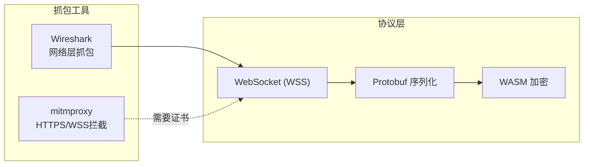
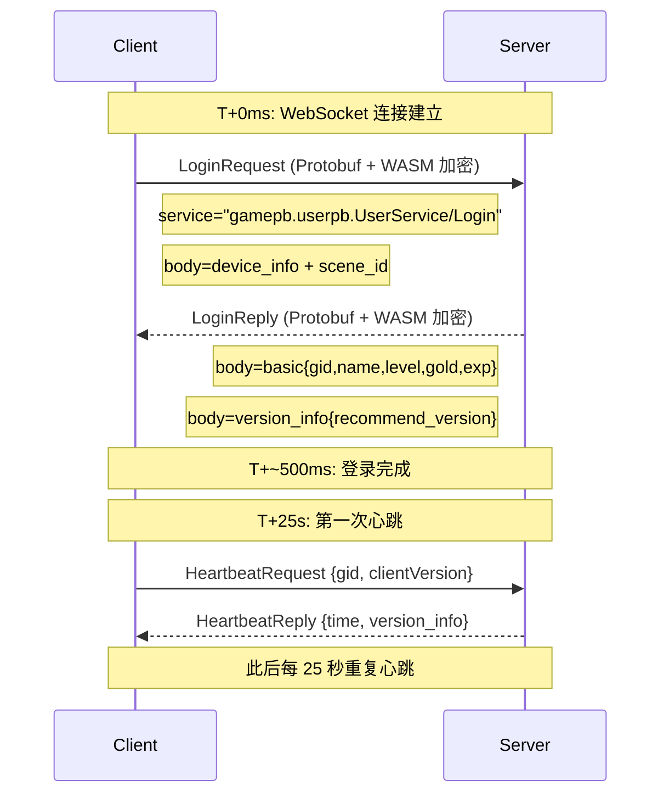

# 数据包分析 (Packet Analysis)

> 来源: 代码逆向分析 | 对比登录前后的 WebSocket 数据包变化
> ⚠️ 以下分析基于代码逻辑推导，实际数据包需通过 Wireshark/mitmproxy 抓包验证

---

## 1. 概述

本项目使用 **WebSocket + Protobuf + WASM 加密** 协议与游戏服务器通信。没有传统 HTTP 请求/响应的数据包可供抓取。



---

## 2. 登录前 vs 登录后对比

### 2.1 连接建立阶段

| 阶段 | 方向 | 内容 | 特征 |
|------|------|------|------|
| 连接前 | - | 无 | 无 WebSocket 连接 |
| 连接中 | C→S | `CONNECT wss://gate-obt.nqf.qq.com/prod/ws` | URL 带参数 |
| 连接后 | S→C | `101 Switching Protocols` | 升级到 WebSocket |

**证据:** `utils/network.js:588-629`

### 2.2 URL 参数变化

**连接时 URL 参数:**
```
wss://gate-obt.nqf.qq.com/prod/ws
  ?platform=qq          # 固定值
  &os=iOS               # 固定值（模拟）
  &ver=1.12.1.6_20260623  # 登录后可能更新
  &code=xxx             # 一次性凭证
  &openID=              # 当前为空
```

**证据:** `utils/network.js` — URL 构建逻辑

### 2.3 请求头对比

| Header | 登录前 | 登录后 |
|--------|--------|--------|
| `User-Agent` | `MicroMessenger/7.0.20.1781(Android)` | 同上（不变） |
| `Origin` | `https://gate-obt.nqf.qq.com` | 同上（不变） |
| Cookie | 无 | 无 |

**结论:** WebSocket 连接期间请求头**不发生变化**。所有状态变化通过 Protobuf 消息体传递。

---

## 3. 消息时间线

### 3.1 登录时间线



**证据:** `utils/network.js:421-508`

### 3.2 消息体变化

| 消息 | client_seq | service_name | method_name | body 内容 | 加密 |
|------|-----------|-------------|-------------|----------|------|
| LoginRequest | 0 | `gamepb.userpb.UserService` | `Login` | device_info, scene_id | WASM |
| LoginReply | 0 | `gamepb.userpb.UserService` | `Login` | basic(gid,level,...), version_info | WASM |
| HeartbeatRequest | N+1 | `gamepb.userpb.UserService` | `Heartbeat` | gid, clientVersion | WASM |
| HeartbeatReply | N+1 | `gamepb.userpb.UserService` | `Heartbeat` | time, version_info | WASM |
| AllLands | N+2 | `gamepb.plantpb.PlantService` | `AllLands` | 无 | WASM |
| Harvest | N+3 | `gamepb.plantpb.PlantService` | `Harvest` | land_ids, host_gid | WASM |

### 3.3 Cookie 变化

**本项目不使用 Cookie 进行游戏认证。** WebSocket 连接和消息传输中不含任何 Cookie 头。

唯一的 Cookie 使用场景:
- `qrsig`: 传统 QQ 网页登录(`qrlogin.js`)，仅在获取和轮询二维码时使用
- **与游戏 WebSocket 完全无关**

---

## 4. 登录成功后的状态变化

### 4.1 内存状态变化

```javascript
// 登录前
userState = {
    gid: 0,           // 未设置
    name: '',
    level: 0,
    gold: 0,
    exp: 0,
    serverTimeOffset: 0,
}

// 登录后 (LoginReply 响应后)
userState = {
    gid: 123456789,        // 从 LoginReply 设置
    name: '玩家昵称',
    level: 32,
    gold: 50000,
    exp: 12345,
    serverTimeOffset: Date.now() - serverTime,  // 服务器时间同步
    clientVersion: '1.12.1.6_20260629',         // 可能被服务器推荐版本更新
}
```

**证据:** `utils/network.js:421-508`

### 4.2 配置变化

```javascript
// 登录前
CONFIG.clientVersion = '1.12.1.6_20260623'

// 登录后 (若服务器返回了 recommend_version)
CONFIG.clientVersion = '1.12.1.6_20260629'  // 被更新
```

**证据:** `utils/network.js` — `version_info` 处理逻辑

### 4.3 定时器变化

| 定时器 | 登录前 | 登录后 | 来源 |
|--------|--------|--------|------|
| 心跳 | ❌ 无 | ✅ 每 25 秒 | network.js |
| 农场巡查 | ❌ 无 | ✅ 可配置间隔 | worker.js |
| 好友巡查 | ❌ 无 | ✅ 可配置间隔 | worker.js |
| 每日任务 | ❌ 无 | ✅ 定时执行 | worker.js |
| 状态同步 | ❌ 无 | ✅ 每 3 秒 | worker.js |
| 自动清理 | ✅ 每 5 分钟 | ✅ 每 5 分钟 | admin.js |

---

## 5. 踢下线数据包分析

### 5.1 KickoutNotify

```protobuf
// KickoutNotify (Protobuf 结构推测)
message KickoutNotify {
    reason: string      // "版本过低" 或其他原因
    // 其他可能字段未知
}
```

**证据:** `utils/network.js:264-297`

```
当收到 KickoutNotify:
1. 检查 reason 是否包含 "版本过低"
2. 如果是 → bumpClientVersion() + reconnect() (最多5次)
3. 否则 → 触发 kickout 事件 → Worker 停止
```

### 5.2 WebSocket 400

**证据:** `worker-manager.js:269-280`

```javascript
// 收到 ws_error 事件，code=400
// 含义: 登录凭证 code 无效/过期
// 处理: 记录日志 "登录失效，请更新 Code"
```

---

## 6. 数据包字段字典

| 字段 | 出现位置 | 类型 | 说明 |
|------|---------|------|------|
| `code` | URL 参数 | string | 登录凭证，一次性 |
| `platform` | URL 参数 | string | qq/wx |
| `os` | URL 参数 | string | 模拟操作系统 |
| `ver` | URL 参数 | string | 客户端版本 |
| `openID` | URL 参数 | string | 保留字段 |
| `client_seq` | GateMessage | number | 客户端序列号 |
| `server_seq` | GateMessage | number | 服务器序列号 |
| `service_name` | GateMessage | string | 服务名 |
| `method_name` | GateMessage | string | 方法名 |
| `body` | GateMessage | bytes | WASM 加密的 Protobuf |
| `encrypt_flag` | GateMessage | boolean | 是否加密 |
| `gid` | Protobuf body | number | 游戏 UID |
| `name` | Protobuf body | string | 游戏昵称 |
| `level` | Protobuf body | number | 等级 |
| `gold` | Protobuf body | number | 金币 |
| `exp` | Protobuf body | number | 经验 |
| `time_now_millis` | Protobuf body | number | 服务器时间戳 |
| `game_version` | version_info | string | 游戏版本 |
| `recommend_version` | version_info | string | 推荐版本 |
| `min_version` | version_info | string | 最低版本 |
| `device_id` | device_info | string | 设备 ID |
| `client_version` | device_info | string | 客户端版本 |
| `scene_id` | LoginRequest | string | 场景 ID (1256) |

---

## 7. 对比总结

| 对比维度 | 登录前 | 登录后 |
|---------|--------|--------|
| WebSocket 连接 | ❌ 无 | ✅ 已建立 |
| URL code 参数 | — | 一次性凭证 |
| gid (用户ID) | 0 | 具体数值 |
| 定时心跳 | ❌ 无 | ✅ 25 秒间隔 |
| 设备信息 | 配置默认值 | 可被运行时配置覆盖 |
| 版本号 | 配置默认值 | 可能被服务器更新 |
| Cookie | 无 | 无 (不使用) |
| HTTP 请求 | 面板 API 可访问 | 面板 API + WebSocket |
| 内存状态 | 空 | 完整的 userState |
| Worker 进程 | 可能有(取决于前次状态) | 一定有 |

---

## 8. 局限性说明

| 限制 | 说明 |
|------|------|
| ✅ **协议逆向完成** | LoginRequest/Reply、Heartbeat、Kicknotify 的结构已通过代码分析确认 |
| ❌ **未实际抓包** | 未使用 Wireshark/mitmproxy 捕获真实流量 |
| ⚠️ **WASM 加密** | 消息体经过 `crypto-wasm.js` 加密，无法直接查看明文 |
| ⚠️ **Protobuf 结构** | 部分字段名和结构为推断，实际以 `.proto` 文件为准 |
| ✅ **认证流程** | 完整的 code 获取 → WebSocket 连接 → 登录 → 心跳维持链已确认 |

> **建议:** 如需实际抓包验证，在 PC 上运行 mitmproxy 并配置 WSS 解密，或使用 Fiddler 配合 WSS 证书解密功能。WASM 加密段需对接 `crypto-wasm.js` 的加解密函数才能还原。
