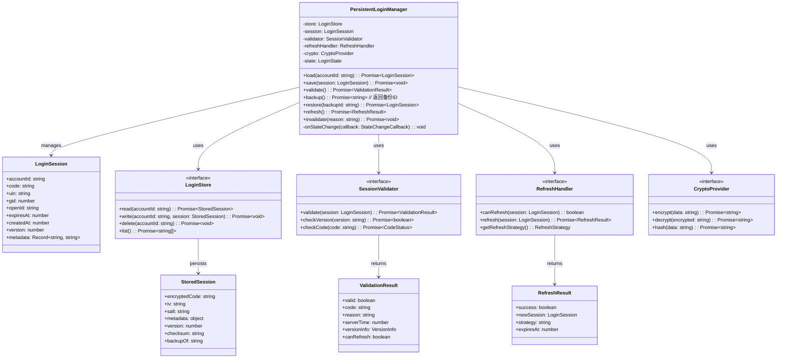
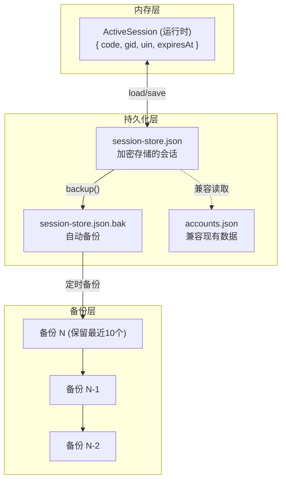
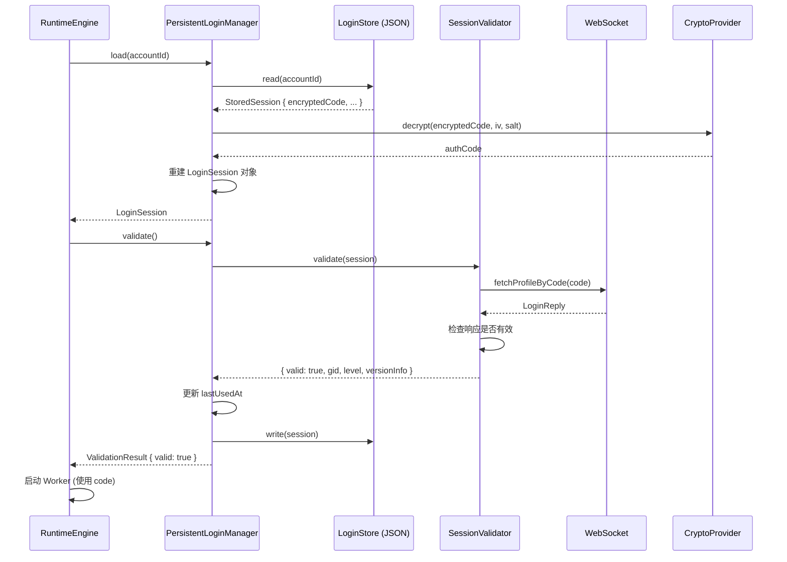
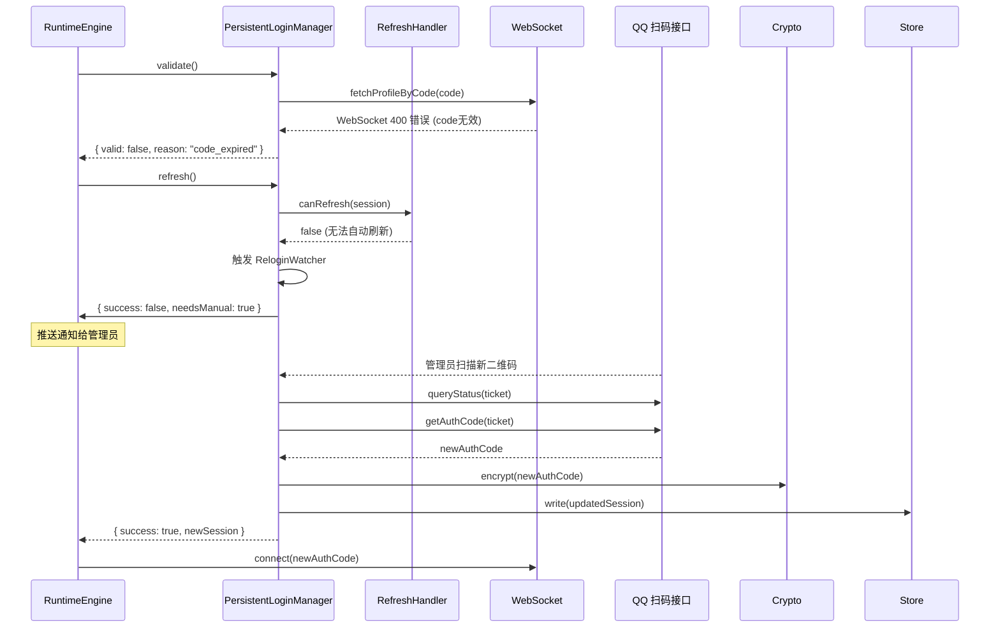
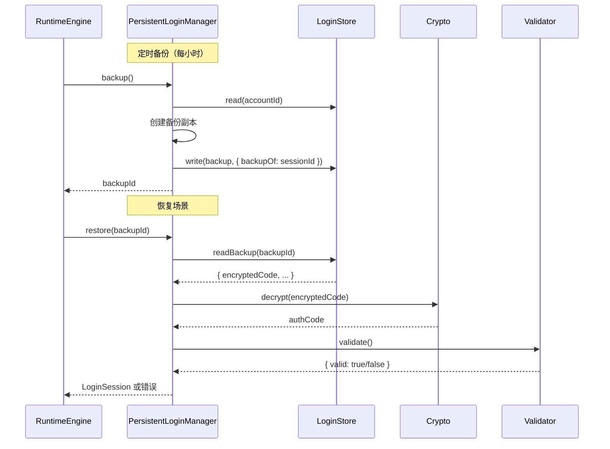
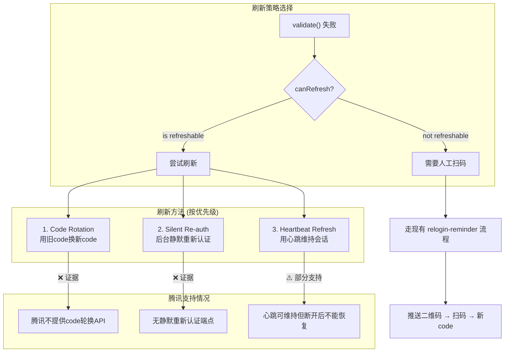
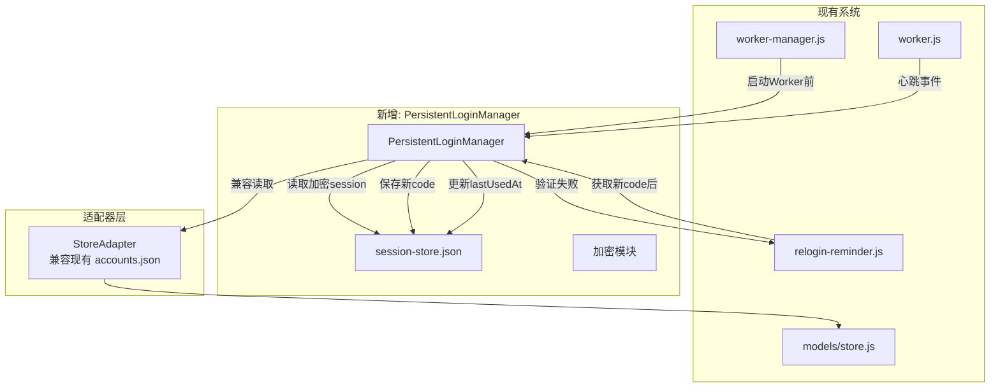

# PersistentLoginManager 设计

> 仅设计，不实现

---

## 1. 设计目标

创建一个可插拔的持久化登录管理器，管理游戏会话（`authCode`）的生命周期：

- 退出/重启后无需重新扫码
- 自动检测会话失效
- 自动尝试恢复会话
- 加密存储凭据
- 与现有架构完全兼容

---

## 2. 类设计



---

## 3. 存储设计

### 3.1 存储层级



### 3.2 持久化格式

```json
{
  "version": 1,
  "sessions": {
    "account_id_1": {
      "encryptedCode": "base64_encrypted_code",
      "iv": "base64_iv",
      "salt": "base64_salt",
      "metadata": {
        "uin": "123456",
        "gid": 789012,
        "nickname": "玩家名",
        "createdAt": 1700000000000,
        "lastUsedAt": 1700088800000,
        "version": "1.12.1.6_20260623",
        "platform": "qq"
      },
      "version": 3,
      "checksum": "sha256_of_all_fields",
      "backupOf": null
    }
  },
  "backupChain": ["backup_id_1", "backup_id_2"]
}
```

### 3.3 原子写入

```javascript
// 写入流程
async function atomicWrite(filePath, data) {
  // 1. 写入临时文件
  await fs.writeFile(`${filePath}.tmp`, JSON.stringify(data));
  // 2. fsync
  await fs.fsync(`${filePath}.tmp`);
  // 3. 重命名（原子操作）
  await fs.rename(`${filePath}.tmp`, filePath);
  // 4. 创建备份
  await fs.copyFile(filePath, `${filePath}.bak`);
}
```

---

## 4. 序列图

### 4.1 正常启动流程



### 4.2 Code 失效恢复流程



### 4.3 备份和恢复



---

## 5. 刷新策略



---

## 6. 与现有架构的集成



---

## 7. 接口定义

```typescript
// ====== 核心接口 ======

interface PersistentLoginManager {
  load(accountId: string): Promise<LoginSession | null>;
  save(session: LoginSession): Promise<void>;
  validate(): Promise<ValidationResult>;
  backup(): Promise<string>;
  restore(backupId: string): Promise<LoginSession>;
  refresh(): Promise<RefreshResult>;
  invalidate(reason: string): Promise<void>;
  onStateChange(callback: (state: LoginState) => void): void;
}

interface LoginSession {
  accountId: string;
  code: string;           // authCode
  uin: string;
  gid: number;
  openId: string;
  nick: string;
  expiresAt: number;      // 服务器过期时间
  createdAt: number;
  lastValidatedAt: number;
  version: number;        // 会话数据版本
  metadata: Record<string, string>;
}

interface ValidationResult {
  valid: boolean;
  code?: string;              // 验证状态码
  reason?: string;            // 不通过的原因
  gid?: number;               // 验证成功时返回gid
  level?: number;             // 等级
  serverTime?: number;
  versionInfo?: VersionInfo;
  canRefresh?: boolean;       // 是否可自动刷新
}

interface RefreshResult {
  success: boolean;
  newSession?: LoginSession;
  strategy?: RefreshStrategy;  // 'code_rotation' | 'silent_reauth' | 'manual'
  expiresAt?: number;
}

interface StoredSession {
  encryptedCode: string;      // AES-256-GCM 加密
  iv: string;                 // 初始化向量
  salt: string;               // 密钥派生盐值
  authTag: string;            // GCM 认证标签
  metadata: Record<string, any>;  // 未加密的元数据
  version: number;            // 存储格式版本
  checksum: string;           // SHA-256 完整性校验
  backupOf: string | null;    // 如果这是备份，指向原session ID
}

// ====== 存储接口 ======

interface LoginStore {
  read(accountId: string): Promise<StoredSession | null>;
  write(accountId: string, session: StoredSession): Promise<void>;
  delete(accountId: string): Promise<void>;
  list(): Promise<string[]>;
  readBackup(backupId: string): Promise<StoredSession>;
  listBackups(): Promise<BackupInfo[]>;
  pruneBackups(maxCount: number): Promise<void>;
}

// ====== 状态枚举 ======

enum LoginState {
  LOADED = 'loaded',            // 已加载
  VALID = 'valid',              // 已验证有效
  EXPIRED = 'expired',          // 已过期
  REFRESHING = 'refreshing',    // 刷新中
  FAILED = 'failed',            // 验证/刷新失败
  INVALIDATED = 'invalidated',  // 主动失效
}

enum RefreshStrategy {
  CODE_ROTATION = 'code_rotation',
  SILENT_REAUTH = 'silent_reauth',
  HEARTBEAT = 'heartbeat',
  MANUAL = 'manual',
}

enum ValidationCode {
  OK = 'ok',
  CODE_EXPIRED = 'code_expired',
  CODE_INVALID = 'code_invalid',
  VERSION_TOO_LOW = 'version_too_low',
  KICKED = 'kicked',
  NETWORK_ERROR = 'network_error',
  UNKNOWN = 'unknown',
}

// ====== 验证器接口 ======

interface SessionValidator {
  validate(session: LoginSession): Promise<ValidationResult>;
  checkVersion(version: string): Promise<boolean>;
  checkCode(code: string): Promise<CodeStatus>;
}

// ====== 刷新处理器接口 ======

interface RefreshHandler {
  canRefresh(session: LoginSession): boolean;
  refresh(session: LoginSession): Promise<RefreshResult>;
  getRefreshStrategy(session: LoginSession): RefreshStrategy;
}
```

---

## 8. 加密方案

| 参数 | 值 | 说明 |
|------|-----|------|
| 算法 | AES-256-GCM | 认证加密 |
| 密钥派生 | PBKDF2 + SHA-256 | 100,000 轮迭代 |
| 密钥来源 | 运行时可配置密码或随机生成 | `PERSISTENT_LOGIN_KEY` 环境变量 |
| 完整性 | GCM 认证标签 + 独立 SHA-256 checksum | 防篡改 |
| 元数据 | 明文存储 | `uid`, `gid` 等无需加密 |
| 盐值 | 随机 16 字节 | 每个会话独立 |

---

## 9. 日志需求

| 事件 | 日志级别 | 内容 |
|------|---------|------|
| Session 加载成功 | INFO | `accountId, lastValidatedAt, version` |
| Session 加载失败 | WARN | `accountId, reason` |
| 验证成功 | INFO | `accountId, gid, level` |
| 验证失败 | WARN | `accountId, code, reason` |
| 备份创建 | INFO | `accountId, backupId` |
| 备份恢复 | INFO | `accountId, backupId` |
| 刷新成功 | INFO | `accountId, strategy` |
| 刷新失败 | ERROR | `accountId, strategy, reason` |
| 加密异常 | ERROR | `accountId, error` |
| 存储异常 | ERROR | `accountId, filePath, error` |
