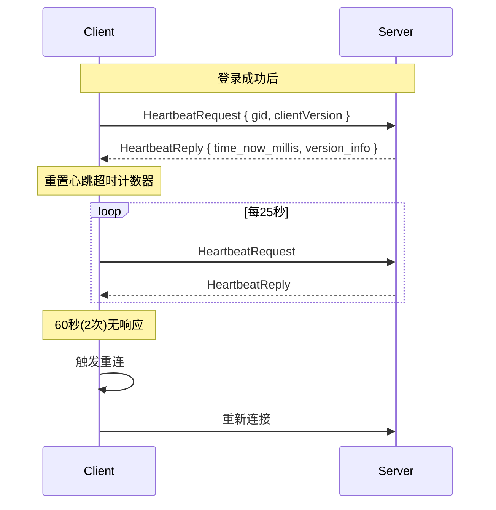
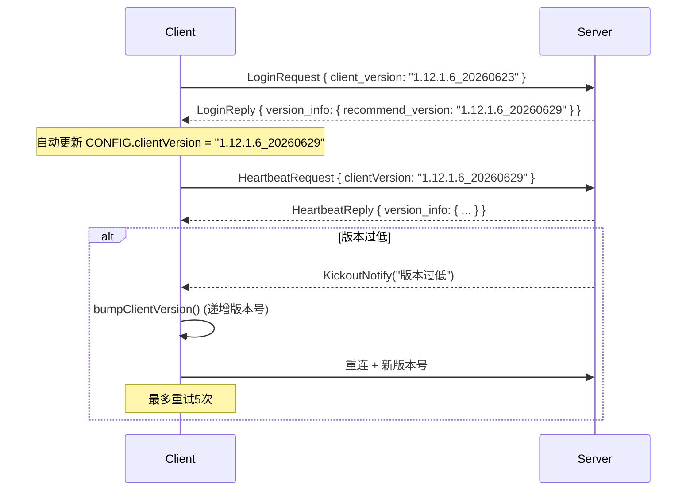
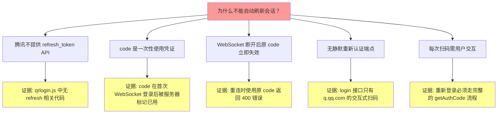
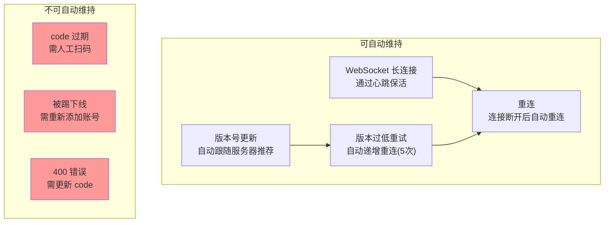

# 协议分析

> 研究腾讯是否支持自动会话刷新

---

## 1. 结论速览

| 机制 | 腾讯支持 | 证据 |
|------|---------|------|
| Refresh Token | ❌ 不支持 | 代码中无任何 refresh_token 相关逻辑 |
| Token Rotation | ❌ 不支持 | code 是一次性的，用完即废 |
| Cookie Rotation | ⚠️ 有限支持 | qrsig cookie 随二维码刷新而旋转 |
| Silent Refresh | ❌ 不支持 | 无静默重新认证端点 |
| Background Login | ❌ 不支持 | 需用户主动扫码 |
| Re-authentication | ❌ 不支持 | 每次需完整扫码流程 |
| Set-Cookie updates | ⚠️ 仅传统QQ登录 | ptqrlogin 响应中有 set-cookie |
| Session Keepalive | ✅ 支持 | WebSocket 心跳维持会话 |
| Heartbeat | ✅ 支持 | 每25秒发送一次 |
| Session Validation | ✅ 支持 | 验证通过 LoginRequest/LoginReply |

---

## 2. WebSocket 认证协议

### 2.1 协议结构

```
┌─────────────────────────────────────────────────┐
│                WebSocket Frame                   │
├─────────────────────────────────────────────────┤
│ GateMessage (Protobuf)                          │
│ ├── client_seq / server_seq (请求-响应配对)      │
│ ├── service_name (如 "gamepb.userpb.UserService")│
│ ├── method_name (如 "Login", "Heartbeat")        │
│ ├── body (Protobuf 序列化 + WASM 加密)           │
│ └── encrypt_flag                                 │
└─────────────────────────────────────────────────┘
```

**证据** (`utils/network.js:79`):
```javascript
const encrypted = await cryptoWasm.encryptBuffer(body);
```

### 2.2 消息序列

| 方向 | 消息 | 频率 | 包含 |
|------|------|------|------|
| C→S | WebSocket Connect | 1次 | URL 参数: code, platform, ver, os |
| S→C | WebSocket Open | 1次 | - |
| C→S | LoginRequest | 1次 | device_info, scene_id |
| S→C | LoginReply | 1次 | gid, level, gold, exp, version_info |
| C→S | HeartbeatRequest | 每25秒 | gid, clientVersion |
| S→C | HeartbeatReply | 每25秒 | time_now_millis, version_info |
| C→S | PlantRequest | 可变 | land_ids, host_gid |
| S→C | PlantReply | 可变 | 操作结果 |
| S→C | KickoutNotify | 异常 | 原因（如版本过低） |
| S→C | FarmHarvestedPush | 推播 | 收获通知 |

---

## 3. 会话保活分析

### 3.1 心跳机制



**证据** (`utils/network.js:514-559`):
```javascript
const HEARTBEAT_INTERVAL = 25000; // 25秒
let hbFailCount = 0;
// 每次心跳响应重置 hbFailCount = 0
// 60秒无响应 (2次) → 触发重连
```

### 3.2 版本协商



**证据** (`utils/network.js:264-297`):
```javascript
if (String(reason).includes('版本过低')) {
    bumpClientVersion();
    reconnect();
}
```

---

## 4. 自动刷新可行性评估

### 4.1 不可自动刷新的原因



### 4.2 可自动维持的部分



---

## 5. 协议安全分析

| 方面 | 实现 | 风险 |
|------|------|------|
| 传输加密 | WSS (WebSocket Secure) | ✅ 安全 |
| 消息体加密 | WASM 加密 (自定义) | ⚠️ 安全性依赖 WASM 实现 |
| 认证凭证 | code 明文在 URL 中 | 🔴 中间人可截获 |
| 设备指纹 | 客户端设备模拟 | 🟢 抗检测 |
| 心跳 | 25秒间隔 | ✅ 正常 |
| 重连 | 5秒后自动重连 | ⚠️ 频繁重连可能被服务器限流 |

---

## 6. 主要协议端点

| 端点 | 协议 | 用途 | 是否可替代 |
|------|------|------|-----------|
| `wss://gate-obt.nqf.qq.com/prod/ws` | WebSocket + Protobuf | 游戏主连接 | ❌ 唯一游戏服务器 |
| `https://q.qq.com/ide/devtoolAuth/GetLoginCode` | HTTPS | 获取登录码 | ⚠️ 可用传统 QQ 登录替代 |
| `https://q.qq.com/ide/devtoolAuth/syncScanSateGetTicket` | HTTPS | 轮询扫码状态 | ⚠️ 同上 |
| `https://q.qq.com/ide/login` | HTTPS | 换取 authCode | ❌ 核心认证接口 |
| `https://ssl.ptlogin2.qq.com/ptqrshow` | HTTPS | 传统 QQ 二维码 | ✅ 备用方案 |
| `https://ssl.ptlogin2.qq.com/ptqrlogin` | HTTPS | 传统 QQ 轮询 | ✅ 备用方案 |
