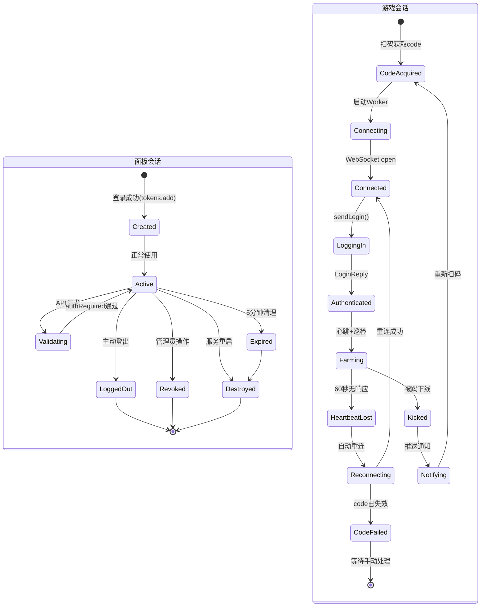

# 登录会话分析

> 来源: 代码逆向分析 | 只输出证据，不做假设

---

## 1. 会话（Session）定义

本项目存在两种完全独立的会话：

| 会话类型 | 系统 | 位置 | 凭证 |
|---------|------|------|------|
| **面板会话** | 管理面板认证 | `controllers/admin.js` | 内存 Token (`x-admin-token`) |
| **游戏会话** | QQ 农场游戏登录 | `utils/network.js` | WebSocket 连接 + `savedCode` |

---

## 2. 面板会话分析

### 什么使会话有效？

**证据** (`controllers/admin.js:80-114`)：
1. Token 必须存在于内存 `tokens` Set 中
2. `tokenUserMap` 中必须有对应的用户对象
3. 非管理员用户：`card.enabled !== false` 且 `card.expiresAt > now`
4. 这些条件在每次 API 请求时都由 `authRequired` 中间件检查

### 什么使会话无效？

**证据**：
- Token 不存在于 `tokens` Set → 401 (`admin.js:82-84`)
- 用户被封禁 (`card.enabled === false`) → 403 + 删除 token + 断开 WebSocket (`admin.js:91-101`)
- 用户过期 (`card.expiresAt < now`) → 403 + 删除 token + 断开 WebSocket (`admin.js:103-110`)
- `POST /api/logout` → 主动删除 token (`admin.js:1150-1164`)
- 管理员操作（禁用/删除/重置密码）→ 强制清除 token 并断开 WebSocket
- 5 分钟定时清理任务 → 清理过期用户 (`admin.js:174-211`)
- 服务进程重启 → 所有 token 清空

### 会话能跨重启吗？

**证据** (`controllers/admin.js:77-79`)：Token 存储在 `const tokens = new Set()` 和 `const tokenUserMap = new Map()`，都是内存变量。服务重启后全部清空。

**结论：❌ 不能跨重启。**

### 会话能跨 IP 变更吗？

**证据**：认证基于 `tokens.has(token)` 查找，不检查源 IP 地址。Token 是随机字符串，只要不泄漏，从任何 IP 使用都有效。

**结论：✅ 能跨 IP（只要 Token 未泄露）。**

### 会话能跨 Cookie 变更吗？

**证据**：系统不使用 Cookie（全局搜索 Cookie 返回：仅 `qrlogin.js` 使用 `qrsig` 用于传统 QQ 登录，与面板认证无关）。Token 通过 `x-admin-token` 请求头传输。

**结论：✅ 能（完全不依赖 Cookie）。**

### 会话能跨机器重启吗？

**证据**：Token 存储在内存中，服务重启丢失。

**结论：❌ 不能。**

---

## 3. 游戏会话（WebSocket）分析

### 什么使会话有效？

**证据** (`utils/network.js`):
1. WebSocket 长连接必须保持
2. `savedCode` 必须是有效的 authCode
3. 心跳每 25 秒正常响应
4. 版本号在服务器允许范围内
5. Worker 子进程存活

### 什么使会话无效？

**证据**：
- WebSocket 错误码 `400` → Code 无效 (`worker-manager.js:269-280`)
- `Kickout` 通知 → 被踢下线 (`network.js:264-297`)
- 连续 2 次心跳无响应（60秒超时）→ 触发重连 (`network.js:514-559`)
- Worker 进程崩溃/退出 → 会话终止
- 版本过低 → 自动递增版本重试（最多 5 次），仍失败则断开

### 游戏会话能跨重启吗？

**证据**：Worker 进程重启后会重新连接。重连使用 `savedCode`（即原来的 authCode）。但由于 authCode 是一次性的，原 code 在首次登录后已失效，重连会被服务器拒绝（400 错误）。

**结论：❌ 不能。** 重启后必须用新 code 连接。

### 游戏会话能跨 IP 变更吗？

**证据**：WebSocket 连接建立时不验证 IP（认证完全依赖 URL 中的 code 参数）。但服务器端可能检测 IP 变更。

**结论：⚠️ 不确定。** 本地不做 IP 绑定检查，但服务器端行为未知。

### 游戏会话能跨机器重启吗？

**证据**：重启后 Worker 进程重建。旧的 WebSocket 连接已断开，需要重新 `connect()`。但 code 已失效。

**结论：❌ 不能。**

---

## 4. 会话状态迁移图

## 5. 会话数据汇总

| 属性 | 面板会话 | 游戏会话 |
|------|---------|---------|
| **认证方式** | 内存随机 Token | WebSocket URL code 参数 |
| **存储位置** | 内存 Set + Map | accounts.json + 内存 |
| **持久化** | ❌ 不持久化 | ✅ code 存 accounts.json |
| **传输** | HTTP 头 `x-admin-token` | WebSocket URL 参数 |
| **服务器重启** | ❌ 丢失 | ❌ code 失效 |
| **程序重启** | ❌ 丢失 | ❌ 需重新连接 |
| **IP 变更** | ✅ 不受影响 | ⚠️ 不确定（服务器端） |
| **刷新机制** | ❌ 无 | ❌ 无（需重新扫码） |
| **过期** | 无固定时间 | 一次性 + 1-5分钟 |
| **撤销** | 手动/管理操作 | 服务器端断开 |

---

## 6. 关键结论

1. **面板认证本质是无状态的** —— token 仅存内存，跨重启不持久
2. **游戏认证本质是一次性的** —— code 用完即废，无 refresh token
3. **Tencent 不提供自动 session refresh** —— 代码中无任何刷新逻辑
4. **现有的"持久登录"是靠 accounts.json 存储 code 实现的** —— 但这只是存储了历史 code，启动时尝试用旧 code 连接会被拒绝
5. **掉线后必须人工介入** —— 自动恢复仅限于版本过低自动重试，code 失效需管理员重新扫码
