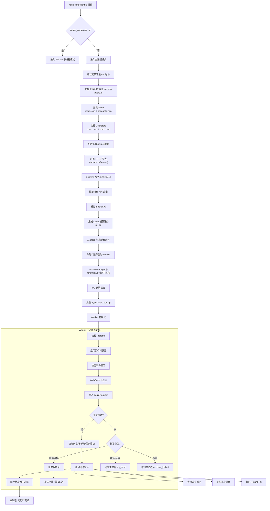
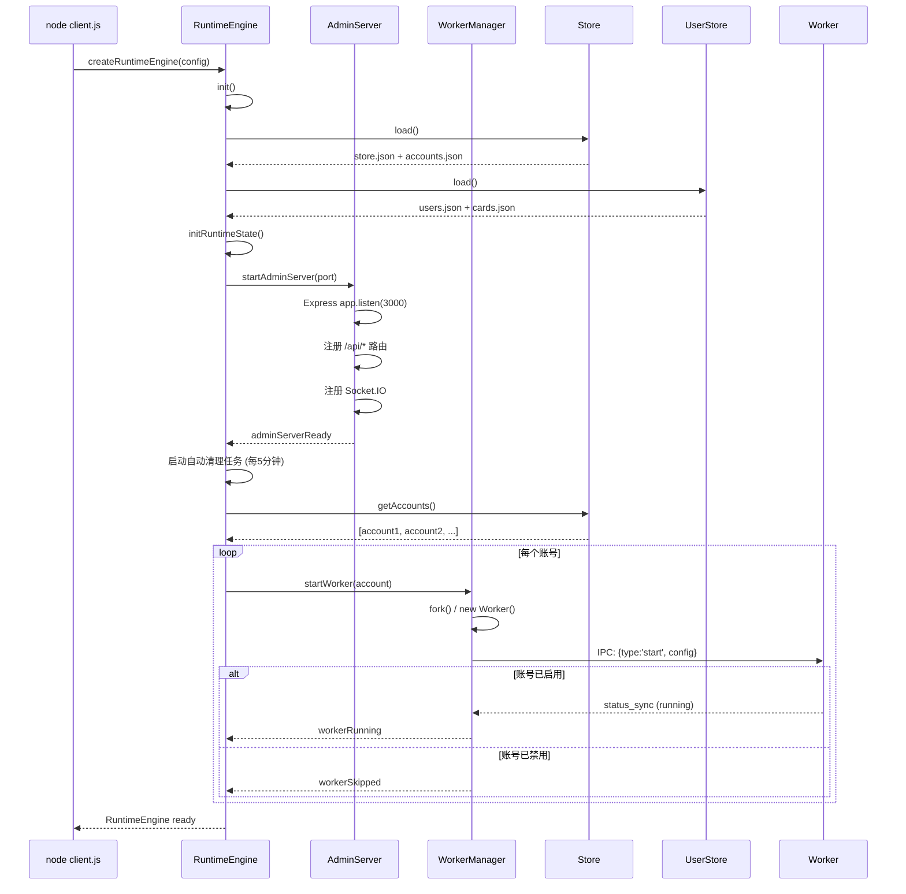
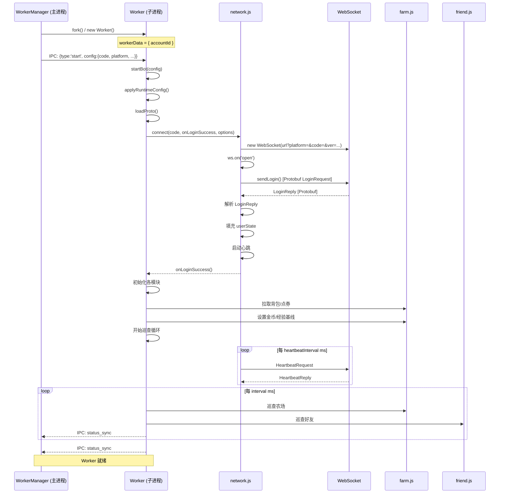
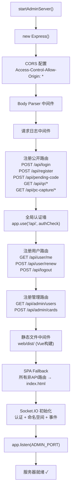

# 启动流程

> 系统启动时的完整流程

## 1. 总启动流程

## 2. 主进程详细启动流程

## 3. Worker 子进程启动流程

## 4. 面板（Express）启动流程

## 5. 关键启动参数

| 阶段 | 耗时 | 说明 |
|------|------|------|
| 加载配置 | <10ms | config.js + runtime-paths.js |
| 加载 Store | <100ms | 读取 store.json + accounts.json（取决于文件大小） |
| 加载 UserStore | <50ms | 读取 users.json + cards.json |
| 启动 Express | <200ms | 注册所有路由 + 中间件 |
| Socket.IO | <100ms | 握手 + 认证配置 |
| 启动 Worker | 500ms+/每个 | fork子进程 + IPC初始化 + WebSocket连接 + 登录 |
| 总计 | 1-5s | 取决于账号数量 |
