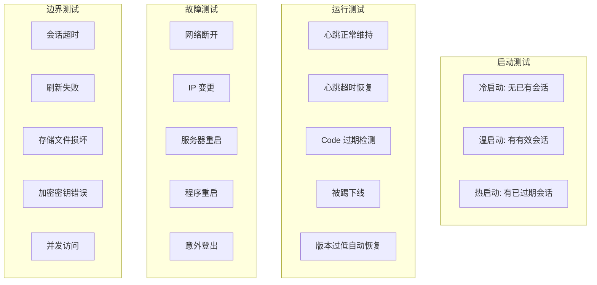

# 测试计划

> PersistentLoginManager 完整测试方案

---

## 1. 测试场景总览



---

## 2. 测试用例

### 2.1 冷启动

```javascript
{
  name: '冷启动 - 无已有会话',
  precondition: 'session-store.json 不存在或为空',
  steps: [
    '启动应用',
    'PLM 初始化',
    'load() 返回 null',
  ],
  expected: '应用正常运行，等待用户手动添加账号',
  type: 'unit + integration',
}
```

### 2.2 温启动

```javascript
{
  name: '温启动 - 有有效会话',
  precondition: 'session-store.json 包含有效加密会话',
  steps: [
    '启动应用',
    'PLM 加载会话',
    'decrypt() 解密 code',
    'validate() 通过 fetchProfileByCode 验证',
    'Worker 使用 code 启动',
  ],
  expected: '账号自动恢复运行，状态显示"在线"',
  type: 'integration',
}
```

### 2.3 Code 过期

```javascript
{
  name: 'Code 过期 - 自动检测 + 通知',
  precondition: '会话中的 code 已过期',
  steps: [
    'PLM 加载会话',
    'validate() 返回 400 错误',
    'canRefresh() 返回 false',
    '触发 NotifyUser 流程',
  ],
  expected: '账号不启动，发送推送通知，标记为待处理',
  type: 'integration',
}
```

### 2.4 网络离线

```javascript
{
  name: '网络离线 - Worker 重连',
  precondition: 'Worker 正在运行',
  steps: [
    '断开网络',
    '心跳超时（60秒）',
    'AutoReconnect（5秒延迟）',
    '网络恢复',
    '重连成功',
  ],
  expected: '心跳超时后自动重连，网络恢复后正常运行',
  type: 'integration + manual',
}
```

### 2.5 IP 变更

```javascript
{
  name: 'IP 变更 - 服务器端反应',
  precondition: 'Worker 正在运行',
  steps: [
    '变更服务器 IP',
    '观察 Worker 状态',
  ],
  expected: '待测试验证（服务器端行为未知）',
  type: 'manual',
  note: '如果服务器检测 IP 变更，可能触发踢下线。如果无检测，Worker 继续运行。'
}
```

### 2.6 机器重启

```javascript
{
  name: '程序重启 - 会话恢复',
  precondition: 'session-store.json 包含有效会话',
  steps: [
    '停止应用 (SIGTERM)',
    '启动应用',
    'PLM load + validate',
    'Worker 启动',
  ],
  expected: '所有账号在冷启动后自动恢复运行',
  type: 'integration',
}
```

### 2.7 意外登出

```javascript
{
  name: '意外登出 - 被踢下线',
  precondition: 'Worker 正在运行',
  steps: [
    '收到 KickoutNotify',
    'Worker 停止',
    'PLM 标记会话失效',
    '推送通知',
  ],
  expected: 'Worker 停止，通知管理员，等待手动重新扫码',
  type: 'integration',
}
```

### 2.8 会话超时

```javascript
{
  name: '会话超时 - 长时间未使用',
  precondition: 'session-store.json 包含会话',
  steps: [
    '设置会话 lastUsedAt 为 30 天前',
    '启动应用',
    'PLM validate()',
  ],
  expected: '会话被视为过期，要求重新登录',
  type: 'unit',
}
```

### 2.9 刷新失败

```javascript
{
  name: '刷新失败 - 所有刷新策略均失败',
  precondition: 'canRefresh() 返回 true 但刷新失败',
  steps: [
    'PLM refresh()',
    '策略1 失败',
    '策略2 失败',
    '回退到 manual 模式',
  ],
  expected: '标记为待处理，推送通知',
  type: 'unit',
}
```

### 2.10 存储文件损坏

```javascript
{
  name: '存储文件损坏 - 从备份恢复',
  precondition: 'session-store.json 损坏，session-store.json.bak 存在',
  steps: [
    'PLM 读取 session-store.json',
    '解析失败',
    '自动尝试读取 session-store.json.bak',
    '从备份恢复',
    '重新写入主文件',
  ],
  expected: '自动从备份恢复，记录 WARN 日志',
  type: 'unit',
}
```

---

## 3. 测试矩阵

| 场景 | 冷启动 | 温启动 | Code过期 | 网络断开 | IP变更 | 机器重启 | 被踢 | 存储损坏 |
|------|--------|--------|---------|---------|-------|---------|------|---------|
| Worker 正常启动 | ✅ | ✅ | ❌ | ✅(重连) | ⚠️未知 | ✅(重启后) | ❌ | ✅ |
| 自动重连 | N/A | N/A | ❌ | ✅ | ❌ | N/A | ❌ | N/A |
| 推送通知 | ❌ | ❌ | ✅ | ❌ | ❌ | ❌ | ✅ | ✅(WARN) |
| 数据加密 | ✅ | ✅ | ✅ | ✅ | ✅ | ✅ | ✅ | ✅ |
| 备份创建 | ✅ | ✅ | N/A | N/A | N/A | ✅ | N/A | ✅ |
| 无损回滚 | N/A | N/A | N/A | N/A | N/A | N/A | N/A | ✅ |

---

## 4. 测试工具

### 4.1 单元测试

```bash
# 运行 PLM 单元测试
npx mocha tests/unit/persistent-login.test.js

# 运行加密模块测试
npx mocha tests/unit/session-crypto.test.js

# 运行存储层测试
npx mocha tests/unit/login-store.test.js
```

### 4.2 集成测试

```bash
# 启动测试服务器
ADMIN_PORT=3099 node core/client.js &

# 运行集成测试
npx mocha tests/integration/login-flow.test.js

# 停止测试服务器
kill %1
```

### 4.3 模拟测试工具

```javascript
// Mock WebSocket 服务器（用于测试）
const WebSocket = require('ws');
const wss = new WebSocket.Server({ port: 19988 });
wss.on('connection', (ws, req) => {
    const url = new URL(req.url, 'wss://localhost');
    const code = url.searchParams.get('code');

    if (code === 'valid_code_123') {
        // 模拟登录成功
        ws.send(encodeLoginReply({ gid: 123456, level: 10 }));
    } else if (code === 'expired_code_456') {
        // 模拟 code 过期
        ws.close(4000, 'code expired');
    }
});
```

---

## 5. 性能测试

| 测试 | 目标 | 指标 |
|------|------|------|
| 启动10个账号 | <5秒 | 所有 Worker 启动完成 |
| 加密100个会话 | <1秒 | 吞吐量 |
| 同时加载50个会话 | <3秒 | 并发读取 |
| 存储文件1MB | <500ms | 读写时间 |
| 备份10个会话 | <2秒 | 备份创建 |
