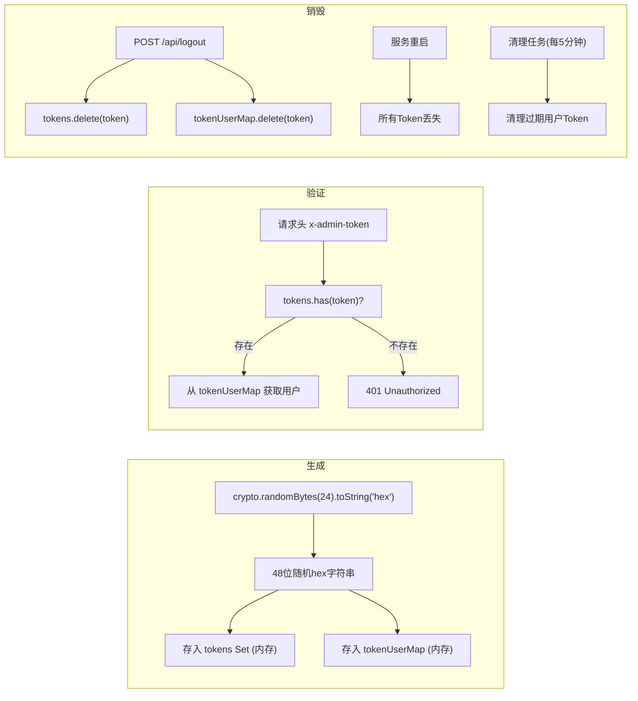
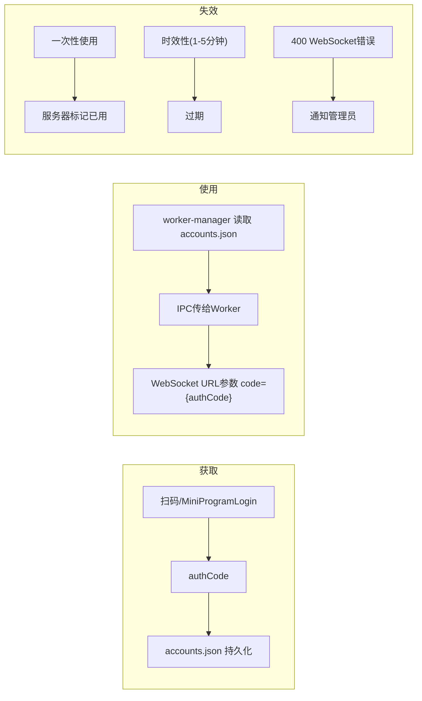
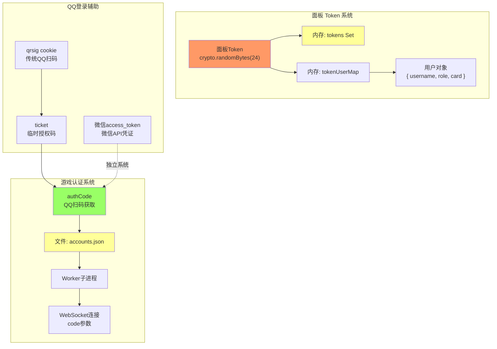

# Token 分析

> 全局搜索所有 Token/Session/Cookie/认证相关关键词

---

## 1. Token/Session 关键词全量扫描

| 关键词 | 出现文件 | 用途 |
|--------|---------|------|
| `Cookie` | `services/qrlogin.js`, `utils/qrutils.js` | QQ 传统网页登录会话标识 `qrsig` |
| `Authorization` | 未出现 | 不使用标准 HTTP Authorization 头 |
| `Bearer` | 未出现 | 不使用 Bearer Token |
| `Token` | `controllers/admin.js` | 面板登录的内存随机 Token |
| `Session` | `services/qrlogin.js` | `MiniProgramLoginSession` / `QRLoginSession` 类名 |
| `pt_local_token` | 未出现 | 不使用 |
| `clientkey` | 未出现 | 不使用 |
| `pt4_token` | 未出现 | 不使用 |
| `pskey` | 未出现 | 不使用 |
| `skey` | 未出现 | 不使用 |
| `uin` | `accounts.json`, `admin.js`, `store.js`, `qrlogin.js` | 用户 QQ 号码 |
| `openid` / `openID` | `network.js`, `store.js`, `admin.js` | WebSocket URL 参数（当前为空） |
| `unionid` / `unionId` | `store.js` (OAuth 配置) | OAuth 唯一标识 |
| `access_token` | `admin.js` (微信 API) | 微信接口调用凭证 |
| `refresh_token` | 未出现 | **不使用 Refresh Token** |
| `Set-Cookie` | `services/qrlogin.js` | QQ 传统登录设置 `qrsig` cookie |
| `x-admin-token` | `controllers/admin.js` | 面板认证自定义请求头 |

---

## 2. Token 类型详情

### 2.1 面板访问 Token

| 属性 | 值 |
|------|-----|
| **生成方式** | `crypto.randomBytes(24).toString('hex')` |
| **长度** | 48 字符（十六进制） |
| **存储位置** | 内存 `Set<string>` + `Map<token, user>` |
| **传输方式** | HTTP 请求头 `x-admin-token` |
| **过期** | 无固定过期时间，服务重启后全部失效 |
| **刷新** | 无刷新机制 |
| **撤销** | `POST /api/logout`、管理员操作、每5分钟清理任务 |

### 2.2 游戏登录 Code

| 属性 | 值 |
|------|-----|
| **生成方式** | `POST https://q.qq.com/ide/login` 用 ticket 换取 |
| **格式** | 字符串（负值表示无效） |
| **存储位置** | `accounts.json` (持久化) + `network.js` (内存 `savedCode`) |
| **传输方式** | WebSocket URL 查询参数 |
| **有效期** | 一次性使用 + 短时效（1-5分钟） |
| **刷新** | **无刷新机制**，过期后需重新扫码 |
| **无效检测** | WebSocket 400 错误 / Worker 无法启动 |

### 2.3 传统 QQ 登录 Cookie (qrsig)

| 属性 | 值 |
|------|-----|
| **生成方式** | `GET https://ssl.ptlogin2.qq.com/ptqrshow` 响应头 `Set-Cookie` |
| **存储位置** | 调用方本地（仅运行时内存） |
| **传输方式** | HTTP 请求头 `Cookie: qrsig={value}` |
| **有效期** | 二维码有效期内 |
| **刷新** | 重新请求二维码 |

### 2.4 微信 access_token

| 属性 | 值 |
|------|-----|
| **生成方式** | `admin.js` 微信 OAuth 流程 |
| **存储位置** | `store.json`（持久化） |
| **用途** | 微信接口调用凭证 |
| **有效期** | 2 小时（微信官方限制） |
| **刷新** | `getWxAccessToken()` 中检测过期后自动刷新 |

---

## 3. Token 图谱

---

## 4. 安全分析

| Token 类型 | 风险等级 | 风险说明 |
|------------|---------|---------|
| 面板 Token | 🔴 中 | 存储在内存，服务重启丢失；48位随机hex安全性足够但无过期机制 |
| 游戏 authCode | 🔴 高 | 一次性使用但有效期短；明文存储在 accounts.json |
| qrsig cookie | 🟢 低 | 仅用于二维码扫描轮询，有效期短 |
| 微信 access_token | 🟡 中 | 2小时过期，但明文存储在 store.json |
| 用户密码 | 🔴 高 | `plainPassword` 明文存储（user-store.js），严重安全风险 |

---

## 5. 缺乏的关键机制

| 机制 | 状态 | 影响 |
|------|------|------|
| JWT Token | ❌ 不使用 | 无签名验证，完全依赖内存查找 |
| Refresh Token | ❌ 不存在 | Token 过期后无法自动恢复 |
| Token 持久化 | ❌ 无 | 服务重启后所有面板会话丢失 |
| Token 轮换 | ❌ 无 | 同一 Token 永不过期 |
| 密码哈希(bcrypt) | ❌ SHA256 | 非慢哈希，暴力破解风险 |
| 明文密码 | ❌ 同时存储 | `plainPassword` 和 `password` 一起存储 |
